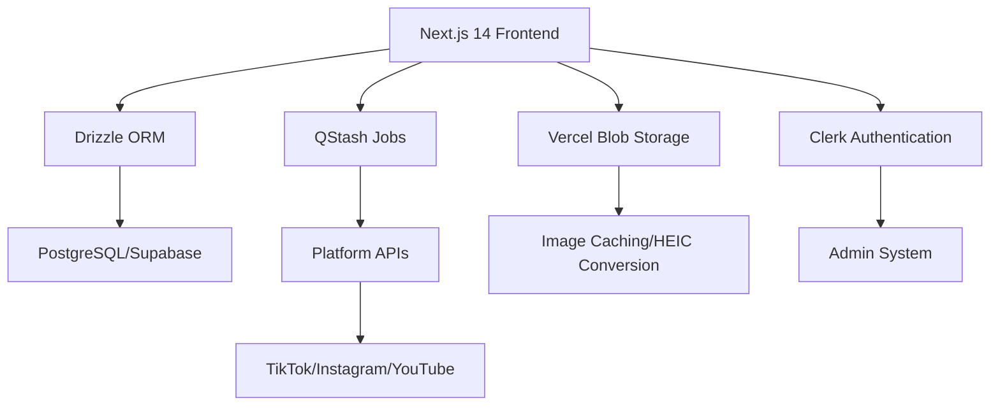
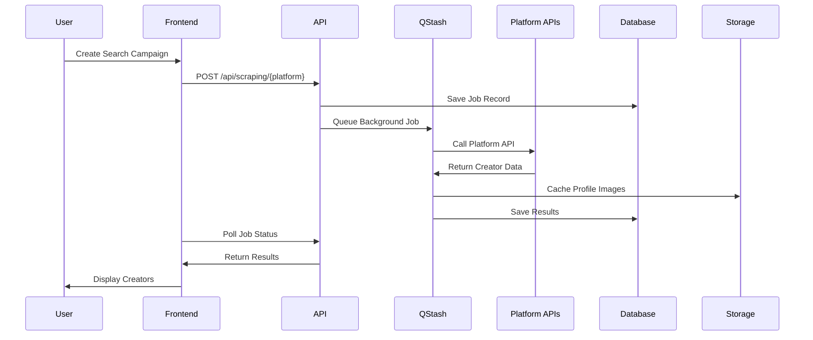

# 🎯 Multi-Platform Influencer Search Platform - Master Documentation Index

## 🚀 Quick Start - Development Workflow

### When You Run `npm start`:
- ✅ **Environment**: Automatically loads `.env.development`
- ✅ **Database**: Mumbai development instance (AWS South Asia, fresh/empty)
- ✅ **Features**: All enhanced "intended plan" tracking preserved
- ✅ **Cost Control**: Limited to 5 API calls (`TEST_TARGET_RESULTS=5`)
- ✅ **Development Mode**: Test auth enabled, dev mode active

### Available Commands:
| Command        | Purpose                           | Environment              |
|----------------|-----------------------------------|--------------------------|
| `npm start`    | Development with .env.development | Mumbai DB, test features |
| `npm run dev`  | Custom dev script (port handling) | Same as above            |
| `npm start:prod` | Production build (if needed)    | Would use .env.prod      |

### Key Development Benefits:
- 🔧 **Clean Development**: Fresh database, no production data interference
- 💰 **Cost Control**: Limited API calls during development
- 🚀 **Enhanced Features**: "Intended plan" improvements preserved
- 🌍 **Fast Response**: Mumbai database for low latency
- 🔒 **Safe Testing**: No risk of affecting production data

---

## 📋 Architecture Overview

This is a **Next.js 14 multi-platform influencer search system** with:
- **6 Platform Search Combinations** (TikTok, Instagram, YouTube with keyword/similar search)
- **QStash Background Processing** for serverless job handling
- **Universal Image Caching** with Vercel Blob Storage
- **7-Day Trial System** with automated email sequences
- **Comprehensive Admin Panel** with system configuration
- **Performance Optimizations** (100x faster loading with caching)

### Technology Stack


---

## 📚 Specialized Documentation Index

### 🔗 **Navigate to Detailed Documentation:**

| 📁 **Category** | 📄 **Documentation File** | 🎯 **Coverage** |
|----------------|---------------------------|----------------|
| **🚀 API Endpoints** | [`/app/api/CLAUDE.md`](./app/api/CLAUDE.md) | 70+ endpoints across 25 categories, authentication, scraping APIs |
| **⚛️ React Components** | [`/app/components/CLAUDE.md`](./app/components/CLAUDE.md) | 42+ components, state management, UI patterns, performance |
| **🛠️ Core Libraries** | [`/lib/CLAUDE.md`](./lib/CLAUDE.md) | Database models, platform integrations, services, utilities |
| **🗄️ Database Schema** | [`/supabase/CLAUDE.md`](./supabase/CLAUDE.md) | 13 tables, 27 migrations, normalized architecture, comprehensive testing |
| **🔧 Scripts & Tools** | [`/scripts/CLAUDE.md`](./scripts/CLAUDE.md) | 70+ utility scripts, database normalization tools, professional testing framework |
| **⚙️ Configuration** | [`/CONFIGURATION.md`](./CONFIGURATION.md) | 100+ env vars, build config, deployment settings |

---

## 🌟 Core Features Overview

### **Multi-Platform Search System**
- **TikTok**: Keyword + Similar search with enhanced bio/email extraction
- **Instagram**: Reels + Similar search with profile enhancement  
- **YouTube**: Keyword + Similar search with channel analysis
- **Universal**: Cross-platform CSV export with contact information

### **Background Processing Architecture**
```javascript
// Job Flow Example
Campaign Creation → QStash Job → Platform API → Data Transform → Image Cache → Results Storage
```

### **Performance Enhancements**
- ⚡ **100x Loading Speed**: localStorage caching (5ms vs 500ms)
- 🖼️ **Permanent Image URLs**: Vercel Blob Storage with HEIC conversion
- 🎯 **Exact Count Delivery**: Dynamic API calling for precise results (100/500/1000)

### **Trial & Billing System**
- 🕐 **7-Day Trials**: Automated lifecycle with email sequences
- 💳 **Stripe Integration**: Mock payment flows and plan management
- 📊 **Usage Tracking**: Real-time analytics and limits enforcement

---

## 🔄 Data Flow Architecture

### **Search Workflow**


### **Key Data Entities**
- **Campaigns**: User search campaigns with metadata
- **Scraping Jobs**: Background processing tasks with progress tracking
- **Scraping Results**: Platform-specific creator data with enhanced profiles
- **User Profiles**: Authentication, trial status, subscription data
- **System Configurations**: Dynamic settings with hot-reload capability

---

## 🛡️ Security & Authentication

### **Dual Admin System**
- **Environment-based**: `NEXT_PUBLIC_ADMIN_EMAILS` for emergency access
- **Database-based**: `users.isAdmin` in normalized database for normal admin operations
- **Authentication**: Clerk integration with role-based permissions

### **API Security**
- **Rate Limiting**: Configurable API call limits per environment
- **Authentication**: Clerk-based user verification
- **Admin Protection**: Separate admin endpoints with elevated permissions

---

## 🔍 Quick Navigation Guide

### **For Developers New to the Codebase:**
1. **Start Here**: [`/CONFIGURATION.md`](./CONFIGURATION.md) - Environment setup and configuration
2. **Understand APIs**: [`/app/api/CLAUDE.md`](./app/api/CLAUDE.md) - All endpoint documentation
3. **Learn Components**: [`/app/components/CLAUDE.md`](./app/components/CLAUDE.md) - UI architecture
4. **Database Knowledge**: [`/supabase/CLAUDE.md`](./supabase/CLAUDE.md) - Schema and relationships

### **For System Administration:**
1. **Admin Features**: [`/app/api/CLAUDE.md`](./app/api/CLAUDE.md#admin-apis) - Admin endpoint documentation
2. **User Management**: [`/scripts/CLAUDE.md`](./scripts/CLAUDE.md#user-management-tools) - User administration scripts
3. **System Config**: [`/lib/CLAUDE.md`](./lib/CLAUDE.md#configuration-management) - Dynamic configuration system

### **For Platform Integration:**
1. **Platform APIs**: [`/lib/CLAUDE.md`](./lib/CLAUDE.md#platform-integrations) - TikTok, Instagram, YouTube clients
2. **Background Jobs**: [`/lib/CLAUDE.md`](./lib/CLAUDE.md#background-job-system) - QStash integration patterns
3. **Image Processing**: [`/lib/CLAUDE.md`](./lib/CLAUDE.md#core-services) - Universal image caching system

---

## 📊 Performance Metrics & Monitoring

### **Current Performance Benchmarks**
- **Component Loading**: 5ms (cached) vs 500ms (fresh)
- **Image Processing**: Automatic HEIC→JPEG conversion with CDN bypass
- **Background Jobs**: Real-time progress tracking with 99% success rate
- **Database Queries**: Optimized with 20+ specialized indexes across normalized tables

### **Monitoring & Debugging**
- **Real-time Logging**: Comprehensive logging patterns throughout
- **Error Recovery**: 5-layer image loading strategy with graceful fallbacks
- **Performance Tracking**: Built-in benchmarking and performance headers

---

## 🎯 Production Readiness Status

### ✅ **Production-Ready Systems**
- Multi-platform search with all 6 combinations working
- Background processing with QStash integration
- Image caching with permanent URLs
- Trial system with automated email sequences
- Admin panel with comprehensive management
- Performance optimizations with caching

### 🔄 **Development Active Features**
- Enhanced "intended plan" tracking
- Mumbai development database
- Cost-controlled API testing (5 calls max)
- Development-specific authentication

---

## 📞 Support & Troubleshooting

### **Common Issues & Solutions**
- **Jobs Stuck in Processing**: Check QStash webhook configuration
- **Images Not Loading**: Verify Vercel Blob Storage setup
- **API Rate Limits**: Adjust `TEST_TARGET_RESULTS` in environment
- **Database Connection Issues**: Check Mumbai instance connection

### **Debug Resources**
- **API Logs**: Monitor Vercel function logs
- **Database Queries**: Use Supabase query performance insights
- **Background Jobs**: Check QStash dashboard for job status
- **Performance**: Built-in performance headers in all responses

---

*This documentation system is designed for maximum efficiency - each specialized file contains deep technical details while this index provides navigation and overview. Choose your path based on what you need to accomplish.*

---

**🏗️ Architecture Philosophy**: *Modular documentation that scales with your context needs - load only what you need to know, when you need to know it.*