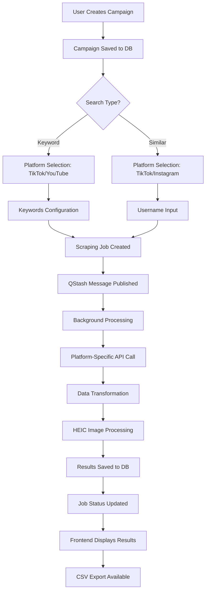
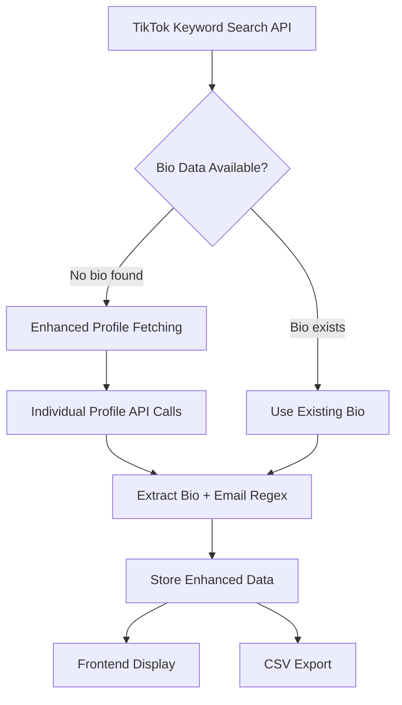

# Multi-Platform Influencer Platform - Complete Technical Documentation

## Overview
This document details the complete end-to-end flow for multi-platform influencer campaign creation, background processing, and results display. Supports TikTok keyword/similar search, Instagram similar search, and YouTube keyword search with comprehensive image handling and async processing.

## Architecture Overview



## Supported Platforms & Search Types

| Platform | Keyword Search | Similar Search | Bio/Email Extraction | Image Support | API Endpoint |
|----------|---------------|----------------|---------------------|---------------|--------------|
| **TikTok** | ✅ | ✅ | ✅ Enhanced Profile Fetching | HEIC → JPEG | `/api/scraping/tiktok`, `/api/scraping/tiktok-similar` |
| **Instagram** | ❌ | ✅ | ✅ Direct from API | Standard | `/api/scraping/instagram` |
| **YouTube** | ✅ | ❌ | ❌ Not Available | Thumbnails | `/api/scraping/youtube` |

## Database Schema

### Core Tables
```sql
-- Main campaigns table
campaigns {
  id: uuid (PK)
  userId: uuid
  name: text
  description: text
  searchType: varchar ('keyword' | 'similar')
  status: varchar ('draft' | 'active' | 'completed')
  createdAt: timestamp
  updatedAt: timestamp
}

-- Background processing jobs (updated schema)
scrapingJobs {
  id: uuid (PK)
  userId: text
  campaignId: uuid (FK -> campaigns.id)
  keywords: jsonb (string[] for keyword search)
  targetUsername: text (for similar search)
  platform: varchar ('TikTok' | 'Instagram' | 'YouTube')
  status: varchar ('pending' | 'processing' | 'completed' | 'error' | 'timeout')
  processedRuns: integer (tracks API calls made)
  processedResults: integer (total creators found)
  targetResults: integer (goal: 100, 500, 1000)
  cursor: integer (pagination for API)
  progress: decimal (0-100)
  timeoutAt: timestamp
  createdAt: timestamp
  updatedAt: timestamp
  startedAt: timestamp
  completedAt: timestamp
  error: text
}

-- Final results storage
scrapingResults {
  id: uuid (PK)
  jobId: uuid (FK -> scrapingJobs.id)
  creators: jsonb (Platform-specific creator data)
  createdAt: timestamp
}
```

## Complete End-to-End Flow

### 1. Campaign Creation Flow

#### Frontend Routes & Components
- **Main Campaign Page**: `/app/campaigns/new/page.jsx`
- **Campaign Form**: `/app/components/campaigns/campaign-form.jsx`
- **Keyword Search**: `/app/campaigns/search/keyword/page.jsx`
- **Similar Search**: `/app/campaigns/search/similar/page.jsx`

### 2. Platform-Specific Implementations

## TikTok Keyword Search Implementation

### File Structure
```
/app/api/scraping/tiktok/route.ts                    # TikTok keyword API endpoint
/app/api/qstash/process-scraping/route.ts            # Background processor (inline TikTok handling)
/app/components/campaigns/keyword-search/
  ├── keyword-search-form.jsx                       # Platform + keyword selection
  ├── search-results.jsx                             # Results display with image handling
  └── search-progress.jsx                            # Progress UI component
```

### API Flow
1. **POST `/api/scraping/tiktok`**
   - Creates job with `platform: 'TikTok'` and `keywords: string[]`
   - Publishes to QStash for background processing
   - Returns `jobId` for polling

2. **QStash Processing** (`/app/api/qstash/process-scraping/route.ts`)
   ```javascript
   // TikTok keyword search handling (inline)
   if (job.platform === 'TikTok' && job.keywords) {
     // Call ScrapeCreators TikTok API
     const apiUrl = `${process.env.SCRAPECREATORS_API_URL}?query=${keywords}&cursor=${cursor}`;
     
     // Transform response to common format
     const creators = transformTikTokResponse(apiResponse);
     
     // Save results and schedule continuation if needed
     if (processedRuns < MAX_API_CALLS_FOR_TESTING) {
       await qstash.publishJSON({ url: callbackUrl, body: { jobId }, delay: '2s' });
     }
   }
   ```

3. **GET `/api/scraping/tiktok?jobId=xxx`**
   - Returns job status and results for frontend polling

### Data Transformation
```javascript
// TikTok API Response → Common Format
const creators = apiResponse.search_item_list.map((item) => {
  const awemeInfo = item.aweme_info || {};
  const author = awemeInfo.author || {};
  
  return {
    creator: {
      name: author.nickname || author.unique_id,
      followers: author.follower_count || 0,
      avatarUrl: author.avatar_medium?.url_list?.[0]?.replace('.heic', '.jpeg'),
    },
    video: {
      description: awemeInfo.desc || 'No description',
      url: awemeInfo.share_url || '',
      statistics: {
        likes: awemeInfo.statistics?.digg_count || 0,
        comments: awemeInfo.statistics?.comment_count || 0,
        views: awemeInfo.statistics?.play_count || 0
      }
    },
    hashtags: awemeInfo.text_extra?.filter(e => e.type === 1).map(e => e.hashtag_name) || [],
    platform: 'TikTok'
  };
});
```

## TikTok Similar Search Implementation

### File Structure
```
/app/api/scraping/tiktok-similar/route.ts             # TikTok similar API endpoint
/lib/platforms/tiktok-similar/
  ├── types.ts                                       # TypeScript interfaces
  ├── api.ts                                         # ScrapeCreators API calls
  ├── transformer.ts                                 # Data transformation
  └── handler.ts                                     # Background processing logic
/app/components/campaigns/similar-search/
  ├── similar-search-form.jsx                       # Username input form
  ├── search-results.jsx                             # Results with progress UI
  └── similar-search-progress.jsx                    # Progress component
```

### Modular Architecture
```javascript
// lib/platforms/tiktok-similar/handler.ts
export async function processTikTokSimilarJob(job: any, jobId: string) {
  // Step 1: Get target user profile
  const profileData = await getTikTokProfile(job.targetUsername);
  
  // Step 2: Extract keywords from profile
  const keywords = extractSearchKeywords(profileData);
  
  // Step 3: Search for similar users using keywords
  const searchResults = await searchTikTokUsers(keywords[0]);
  
  // Step 4: Transform and filter results
  const creators = transformTikTokUsers(searchResults, keywords);
  
  // Step 5: Save results and handle continuation
  if (processedRuns < MAX_API_CALLS_FOR_TESTING) {
    await qstash.publishJSON({ url: callbackUrl, body: { jobId }, delay: '2s' });
  } else {
    await markJobCompleted(jobId);
  }
}
```

### QStash Integration
```javascript
// /app/api/qstash/process-scraping/route.ts
else if (job.platform === 'TikTok' && job.targetUsername) {
  const result = await processTikTokSimilarJob(job, jobId);
  return NextResponse.json(result);
}
```

## YouTube Keyword Search Implementation

### File Structure
```
/app/api/scraping/youtube/route.ts                   # YouTube API endpoint
/lib/platforms/youtube/
  ├── types.ts                                       # YouTube-specific interfaces
  ├── api.ts                                         # ScrapeCreators YouTube API
  ├── transformer.ts                                 # YouTube data transformation
  └── handler.ts                                     # Background processing
```

### Modular Processing
```javascript
// lib/platforms/youtube/handler.ts
export async function processYouTubeJob(job: any, jobId: string) {
  // Check testing limits
  if (currentRuns >= MAX_API_CALLS_FOR_TESTING) {
    return markJobCompleted(jobId);
  }

  // Call YouTube API
  const searchParams = { keywords: job.keywords, mode: 'keyword' };
  const youtubeResponse = await searchYouTube(searchParams);
  
  // Transform and save
  const creators = transformYouTubeVideos(youtubeResponse.videos, job.keywords);
  await saveResults(jobId, creators);
  
  // Schedule continuation or complete
  if (newProcessedRuns < MAX_API_CALLS_FOR_TESTING) {
    await scheduleNextCall(jobId);
  } else {
    await markJobCompleted(jobId);
  }
}
```

### YouTube Data Transformation
```javascript
// lib/platforms/youtube/transformer.ts
export function transformYouTubeVideo(video, keywords = []) {
  return {
    creator: {
      name: video.channel?.title || 'Unknown Channel',
      followers: 0, // Not available in YouTube search API
      avatarUrl: video.channel?.thumbnail || ''
    },
    video: {
      description: video.title || 'No title',
      url: video.url || '',
      statistics: {
        views: video.viewCountInt || 0, // Only views available
        likes: 0, comments: 0, shares: 0 // Not available in search API
      }
    },
    hashtags: extractHashtags(video.title || ''),
    publishedTime: video.publishedTime || '',
    lengthSeconds: video.lengthSeconds || 0,
    platform: 'YouTube'
  };
}
```

## Instagram Similar Search Implementation

### File Structure
```
/app/api/scraping/instagram/route.ts                 # Instagram API endpoint
/app/api/qstash/process-scraping/route.ts            # Inline Instagram processing
```

### Inline Processing (Single API Call)
```javascript
// Instagram processing in QStash handler (lines 164-399)
if (job.platform === 'Instagram' && job.targetUsername) {
  // Single API call - no continuation needed
  const apiUrl = `${process.env.SCRAPECREATORS_INSTAGRAM_API_URL}?handle=${job.targetUsername}`;
  const response = await fetch(apiUrl, { headers: { 'x-api-key': apiKey } });
  
  // Transform related profiles
  const relatedProfiles = response.data.user.edge_related_profiles.edges.map(edge => ({
    id: edge.node.id,
    username: edge.node.username,
    full_name: edge.node.full_name,
    is_private: edge.node.is_private,
    is_verified: edge.node.is_verified,
    profile_pic_url: edge.node.profile_pic_url
  }));
  
  // Save and complete immediately
  await saveResults(jobId, relatedProfiles);
  await markJobCompleted(jobId);
}
```

## Image Proxy System - Universal HEIC & CDN Handling

### File Structure
```
/app/api/proxy/image/route.ts                        # Universal image proxy with HEIC conversion
```

### Comprehensive Image Processing Pipeline

#### 1. HEIC Conversion (Vercel-Compatible)
```javascript
// Primary: heic-convert package (works on Vercel)
import convert from 'heic-convert';

if (isHeic || contentType === 'image/heic') {
  try {
    const outputBuffer = await convert({
      buffer: buffer,
      format: 'JPEG',
      quality: 0.85
    });
    buffer = Buffer.from(outputBuffer);
    contentType = 'image/jpeg';
    console.log('✅ [IMAGE-PROXY] HEIC conversion successful with heic-convert');
  } catch (heicError) {
    // Fallback to Sharp if available
    console.log('🔄 [IMAGE-PROXY] Trying Sharp as fallback...');
  }
}
```

#### 2. TikTok CDN 403 Handling (5-Layer Strategy)
```javascript
// Layer 1: Enhanced headers with TikTok referrer
const fetchHeaders = {
  'User-Agent': 'Mozilla/5.0...',
  'Referer': 'https://www.tiktok.com/',
  'Origin': 'https://www.tiktok.com'
};

// Layer 2: Remove referrer headers
if (response.status === 403) {
  delete headers['Referer'];
  delete headers['Origin'];
  response = await fetch(url, { headers });
}

// Layer 3: Simplify URL (remove query parameters)
if (still403) {
  const simplifiedUrl = imageUrl.split('?')[0];
  response = await fetch(simplifiedUrl, { headers });
}

// Layer 4: Minimal curl-like headers
if (still403) {
  const minimalHeaders = { 'User-Agent': 'curl/7.68.0', 'Accept': '*/*' };
  response = await fetch(simplifiedUrl, { headers: minimalHeaders });
}

// Layer 5: Alternative CDN domains
if (still403) {
  const cdnDomains = ['p16-sign-va.tiktokcdn.com', 'p19-sign-va.tiktokcdn.com'];
  for (const domain of cdnDomains) {
    const altUrl = simplifiedUrl.replace(/p\d+-[^.]+\.tiktokcdn[^/]*/, domain);
    response = await fetch(altUrl, { headers: minimalHeaders });
    if (response.ok) break;
  }
}
```

#### 3. SVG Placeholder Generation
```javascript
// Final fallback: Generate colored avatar placeholders
if (allAttemptsFailed && imageUrl.includes('tiktokcdn')) {
  const username = extractUsernameFromUrl(imageUrl);
  const color = `hsl(${username.charCodeAt(0) * 7 % 360}, 70%, 50%)`;
  const initial = username.charAt(0).toUpperCase();
  
  const placeholderSvg = `
    <svg width="200" height="200" xmlns="http://www.w3.org/2000/svg">
      <circle cx="100" cy="100" r="100" fill="${color}"/>
      <text x="100" y="120" font-family="Arial" font-size="80" font-weight="bold" 
            fill="white" text-anchor="middle">${initial}</text>
    </svg>
  `;
  
  return new NextResponse(Buffer.from(placeholderSvg), {
    headers: { 'Content-Type': 'image/svg+xml' }
  });
}
```

### Response Headers for Debugging
```javascript
headers: {
  'Content-Type': contentType,
  'X-Image-Proxy-Time': totalTime.toString(),
  'X-Image-Proxy-Source': 'heic-converted' | 'original' | 'placeholder-403',
  'X-Image-Original-Format': 'heic' | 'other' | 'blocked',
  'X-Image-Fetch-Strategy': 'initial-success' | 'no-referrer' | 'simplified-url' | 'minimal-headers' | 'alternative-domain' | 'placeholder',
  'X-Image-Final-Status': response.status.toString()
}
```

## Frontend Image Loading with Enhanced Debugging

### Universal Image Loading Handlers
```javascript
// app/components/campaigns/keyword-search/search-results.jsx
// app/components/campaigns/similar-search/search-results.jsx

const handleImageLoad = (e, username) => {
  const img = e.target;
  console.log('✅ [BROWSER-IMAGE] Image loaded successfully for', username);
  console.log('  📏 Natural size:', img.naturalWidth + 'x' + img.naturalHeight);
  console.log('  🔗 Loaded URL:', img.src);
  console.log('  ⏱️ Load time:', (Date.now() - parseInt(img.dataset.startTime || '0')) + 'ms');
};

const handleImageError = (e, username, originalUrl) => {
  console.error('❌ [BROWSER-IMAGE] Image failed to load for', username);
  console.error('  🔗 Failed URL:', img.src);
  console.error('  📍 Original URL:', originalUrl);
  img.style.display = 'none'; // Hide broken images
};

// Usage in AvatarImage
<AvatarImage
  src={getProxiedImageUrl(creator.profile_pic_url)}
  onLoad={(e) => handleImageLoad(e, creator.username)}
  onError={(e) => handleImageError(e, creator.username, creator.profile_pic_url)}
  onLoadStart={(e) => handleImageStart(e, creator.username)}
/>
```

## CSV Export System

### Universal Export Handler
```javascript
// app/api/export/csv/route.ts
export async function GET(req: Request) {
  const { searchParams } = new URL(req.url);
  const jobId = searchParams.get('jobId');
  
  // Get job with results
  const job = await db.query.scrapingJobs.findFirst({
    where: eq(scrapingJobs.id, jobId),
    with: { results: true }
  });
  
  // Platform-specific CSV generation
  if (job.platform === 'YouTube') {
    return generateYouTubeCSV(job);
  } else if (job.platform === 'TikTok') {
    return generateTikTokCSV(job);
  } else if (job.platform === 'Instagram') {
    return generateInstagramCSV(job);
  }
}
```

### Platform-Specific CSV Formats

#### YouTube CSV Export
```javascript
headers = [
  'Channel Name', 'Video Title', 'Video URL', 'Views', 
  'Duration (seconds)', 'Published Date', 'Hashtags', 'Keywords', 'Platform'
];

row = [
  creator.name,
  video.description, // Video title
  video.url,
  stats.views || 0,
  item.lengthSeconds || 0,
  publishedDate,
  hashtags,
  keywords,
  'YouTube'
];
```

#### TikTok CSV Export (Keyword & Similar)
```javascript
headers = [
  'Creator Name', 'Followers', 'Video Description', 'Video URL',
  'Likes', 'Comments', 'Shares', 'Views', 'Hashtags', 'Platform', 'Keywords'
];

row = [
  creator.name,
  creator.followers || 0,
  video.description,
  video.url,
  stats.likes || 0,
  stats.comments || 0,
  stats.shares || 0,
  stats.views || 0,
  hashtags,
  'TikTok',
  keywords
];
```

#### Instagram CSV Export (Similar)
```javascript
headers = [
  'Username', 'Full Name', 'Private', 'Verified', 'Platform', 'Search Type'
];

row = [
  creator.username,
  creator.full_name,
  creator.is_private ? 'Yes' : 'No',
  creator.is_verified ? 'Yes' : 'No',
  'Instagram',
  'Similar'
];
```

## Bio & Email Extraction System

### Overview
The platform features an advanced bio and email extraction system that automatically retrieves creator profile information including bio content and email addresses. This system addresses the limitation where TikTok keyword search API doesn't include bio data by implementing enhanced profile fetching.

### Architecture



### Problem Solved
**Issue**: TikTok keyword search API returns `author.signature: undefined`, meaning no bio/email data was available.
**Solution**: Automatic enhanced profile fetching that makes additional API calls to get complete profile information.

### Implementation Details

#### 1. **Backend Data Transformation** (`/app/api/qstash/process-scraping/route.ts`)

**Enhanced Profile Fetching Logic** (Lines 743-779):
```javascript
// Enhanced Profile Fetching: If no bio found, try to get full profile data
let enhancedBio = bio;
let enhancedEmails = extractedEmails;

if (!bio && author.unique_id) {
  try {
    console.log(`🔍 [PROFILE-FETCH] Attempting to fetch full profile for @${author.unique_id}`);
    
    // Make profile API call to get bio data
    const profileApiUrl = `https://api.scrapecreators.com/v1/tiktok/profile?handle=${encodeURIComponent(author.unique_id)}`;
    const profileResponse = await fetch(profileApiUrl, {
      headers: { 'x-api-key': process.env.SCRAPECREATORS_API_KEY! }
    });
    
    if (profileResponse.ok) {
      const profileData = await profileResponse.json();
      const profileUser = profileData.user || {};
      
      enhancedBio = profileUser.signature || profileUser.desc || profileUser.bio || '';
      const enhancedEmailMatches = enhancedBio.match(emailRegex) || [];
      enhancedEmails = enhancedEmailMatches;
    }
  } catch (profileError) {
    console.log(`❌ [PROFILE-FETCH] Error fetching profile for @${author.unique_id}:`, profileError.message);
  }
}
```

**Email Extraction Regex** (Lines 728-729):
```javascript
const emailRegex = /[\w\.-]+@[\w\.-]+\.\w+/g;
const extractedEmails = bio.match(emailRegex) || [];
```

**Enhanced Creator Data Structure** (Lines 784-795):
```javascript
creator: {
  name: author.nickname || author.unique_id || 'Unknown Creator',
  followers: author.follower_count || 0,
  avatarUrl: (author.avatar_medium?.url_list?.[0] || '').replace('.heic', '.jpeg'),
  profilePicUrl: (author.avatar_medium?.url_list?.[0] || '').replace('.heic', '.jpeg'),
  bio: enhancedBio,                    // ✅ Enhanced bio from profile API
  emails: enhancedEmails,              // ✅ Extracted emails array
  uniqueId: author.unique_id || '',
  verified: author.is_verified || false
}
```

#### 2. **Sequential Processing with Rate Limiting** (Lines 714-823)

**Rate-Limited Processing**:
```javascript
// Sequential processing to avoid API rate limits
const creators = [];
for (let i = 0; i < apiResponse.search_item_list.length; i++) {
  const item = apiResponse.search_item_list[i];
  // ... process each creator
  
  creators.push(creatorData);
  
  // Add delay between profile API calls
  if (i < apiResponse.search_item_list.length - 1) {
    await new Promise(resolve => setTimeout(resolve, 100)); // 100ms delay
  }
}
```

#### 3. **Frontend Display Enhancement** (`/app/components/campaigns/keyword-search/search-results.jsx`)

**New Table Columns** (Lines 310-317):
```javascript
<TableHeader>
  <TableRow>
    <TableHead>Profile</TableHead>
    <TableHead>Creator Name</TableHead>
    <TableHead>Bio</TableHead>           // ✅ NEW
    <TableHead>Email</TableHead>         // ✅ NEW
    <TableHead>Date</TableHead>
    <TableHead>Video Title</TableHead>
    // ... rest of columns
  </TableRow>
</TableHeader>
```

**Bio Display Component** (Lines 380-388):
```javascript
<TableCell>
  <div className="max-w-[200px] truncate" title={creator.creator?.bio || 'No bio available'}>
    {creator.creator?.bio ? (
      <span className="text-sm text-gray-700">{creator.creator.bio}</span>
    ) : (
      <span className="text-gray-400 text-sm">No bio</span>
    )}
  </div>
</TableCell>
```

**Email Display Component** (Lines 389-420):
```javascript
<TableCell>
  {creator.creator?.emails && creator.creator.emails.length > 0 ? (
    <div className="space-y-1">
      {creator.creator.emails.map((email, emailIndex) => (
        <div key={emailIndex} className="flex items-center gap-1">
          <a 
            href={`mailto:${email}`}
            className="text-blue-600 hover:underline text-sm"
            title={`Send email to ${email}`}
          >
            {email}
          </a>
          <svg className="w-3 h-3 opacity-60 text-blue-600" /* email icon SVG */>
        </div>
      ))}
    </div>
  ) : (
    <span className="text-gray-400 text-sm">No email</span>
  )}
</TableCell>
```

**Clickable Creator Names** (Lines 351-375):
```javascript
<TableCell>
  {creator.creator?.name && creator.creator.name !== 'N/A' ? (
    <a 
      href={renderProfileLink(creator)}
      target="_blank"
      rel="noopener noreferrer"
      className="text-blue-600 hover:text-blue-800 hover:underline font-medium transition-colors duration-200 flex items-center gap-1"
      title={`View ${creator.creator.name}'s profile on ${searchData.selectedPlatform || 'TikTok'}`}
    >
      {creator.creator.name}
      <svg className="w-3 h-3 opacity-70" /* external link icon */>
    </a>
  ) : (
    <span className="text-gray-500">N/A</span>
  )}
</TableCell>
```

#### 4. **CSV Export Enhancement** (`/app/api/export/csv/route.ts`)

**Updated TikTok CSV Headers** (Lines 335-350):
```javascript
headers = [
  'Username',
  'Followers',
  'Bio',           // ✅ NEW
  'Email',         // ✅ NEW
  'Video URL',
  'Description',
  'Likes',
  'Comments',
  'Shares',
  'Views',
  'Hashtags',
  'Created Date',
  'Keywords',
  'Platform'
];
```

**Enhanced CSV Row Data** (Lines 386-394):
```javascript
// Extract bio and emails for TikTok export
const bio = (creator.bio || '').replace(/"/g, '""'); // Escape quotes for CSV
const emails = Array.isArray(creator.emails) ? creator.emails.join('; ') : '';

row = [
  `"${creator.name || ''}"`,
  `"${creator.followers || 0}"`,
  `"${bio}"`,        // ✅ NEW: Full bio in CSV
  `"${emails}"`,     // ✅ NEW: All emails (semicolon-separated)
  // ... rest of row data
];
```

### Comprehensive Logging System

#### **Profile Fetching Logs**:
```javascript
🔍 [PROFILE-ENHANCEMENT] Starting enhanced profile data fetching for creators with missing bio data
🔍 [PROFILE-ENHANCEMENT] Processing 30 creators
🔍 [PROFILE-FETCH] Attempting to fetch full profile for @therightonehq
✅ [PROFILE-FETCH] Successfully fetched profile for @therightonehq: {
  bioFound: true,
  bioLength: 85,
  emailsFound: 1,
  bioPreview: "Your source for Apple news, rumors, and reviews 📱💻⌚ Contact us: tips@apple..."
}
```

#### **Bio & Email Extraction Logs**:
```javascript
📝 [BIO-EXTRACTION] Processing bio for item: {
  authorUniqueId: 'appleinsiderofficial',
  authorNickname: 'AppleInsider',
  rawSignature: undefined,
  finalBio: 'Your source for Apple news, rumors, and reviews 📱💻⌚ Contact us: tips@appleinsider.com 📧',
  bioLength: 85,
  bioValue: 'Your source for Apple news, rumors, and reviews...'
}
📧 [EMAIL-EXTRACTION] Email extraction result: {
  bioInput: 'Your source for Apple news, rumors, and reviews 📱💻⌚ Contact us: tips@appleinsider.com 📧',
  emailsFound: ['tips@appleinsider.com'],
  emailCount: 1
}
```

#### **Transformation Logs**:
```javascript
📧 [TRANSFORMATION] Bio & Email extraction: {
  bioLength: 85,
  bioPreview: "Your source for Apple news, rumors, and reviews 📱💻⌚ Contact us: tips@apple...",
  extractedEmails: ["tips@appleinsider.com"],
  emailCount: 1
}
```

### Email Pattern Matching

**Supported Email Formats**:
- ✅ `tips@appleinsider.com`
- ✅ `contact@example.co.uk`
- ✅ `hello.world@company-name.org`
- ✅ `user123@domain.io`
- ✅ `support+help@business.com`

**Regex Pattern**: `/[\w\.-]+@[\w\.-]+\.\w+/g`

### Performance Optimizations

1. **Sequential Processing**: Prevents API rate limiting
2. **100ms Delays**: Between profile API calls
3. **Error Handling**: Failed profile fetches don't break the process
4. **Graceful Fallbacks**: Shows "No bio" instead of crashing
5. **Comprehensive Caching**: Profile data is cached within the same processing run

### Features & Benefits

#### **For Users**:
- ✅ **Lead Generation**: Automatically extract contact emails from creator bios
- ✅ **Professional Outreach**: Direct mailto links for immediate contact
- ✅ **Complete Profiles**: Full bio context for better creator understanding
- ✅ **Time Saving**: No manual copy-pasting of email addresses

#### **For Developers**:
- ✅ **Comprehensive Logging**: Detailed debugging information
- ✅ **Error Recovery**: Robust error handling and fallbacks
- ✅ **Rate Limiting**: Respects API limits with controlled concurrency
- ✅ **CSV Integration**: Bio and email data included in exports

### Debugging & Monitoring

#### **Success Indicators**:
```javascript
✅ [PROFILE-FETCH] Successfully fetched profile for @username
📧 [EMAIL-EXTRACTION] Email extraction result: { emailsFound: ["email@domain.com"], emailCount: 1 }
🔄 [TRANSFORMATION] Bio & Email extraction: { bioLength: 85, emailCount: 1 }
```

#### **Error Patterns**:
```javascript
⚠️ [PROFILE-FETCH] Failed to fetch profile for @username: 429
❌ [PROFILE-FETCH] Error fetching profile for @username: Network timeout
📝 [BIO-DEBUG] Signature field analysis: { hasSignature: false, signatureValue: 'NO_SIGNATURE_FOUND' }
```

### Testing & Validation

**Test the system by**:
1. **Running a TikTok keyword search** with creators known to have bios
2. **Monitoring server logs** for profile fetching activity
3. **Checking the results table** for bio and email columns
4. **Testing CSV export** to verify data inclusion
5. **Clicking email links** to test mailto functionality

## Testing Configuration

### API Call Limits
```javascript
// /app/api/qstash/process-scraping/route.ts
const MAX_API_CALLS_FOR_TESTING = 1; // Limits to 1 API call for testing

// For production, change to:
const MAX_API_CALLS_FOR_TESTING = 999; // Or remove limit entirely
```

### Local Development Setup
```bash
# Install dependencies
npm install heic-convert

# Environment variables needed
SCRAPECREATORS_API_KEY=xxx
SCRAPECREATORS_API_URL=https://api.scrapecreators.com/v1/tiktok/search/keyword
SCRAPECREATORS_INSTAGRAM_API_URL=https://api.scrapecreators.com/v1/instagram/profile
QSTASH_TOKEN=xxx
DATABASE_URL=xxx

# For local development with QStash
ngrok http 3000
# Update NEXT_PUBLIC_SITE_URL to ngrok URL
```

## Environment Configuration

### Required Environment Variables
```bash
# Database
DATABASE_URL="postgresql://..."
NEXT_PUBLIC_SUPABASE_URL=https://xxx.supabase.co
SUPABASE_SERVICE_ROLE_KEY=xxx

# QStash (Background Processing)
QSTASH_URL=https://qstash.upstash.io
QSTASH_TOKEN=xxx
QSTASH_CURRENT_SIGNING_KEY=xxx
QSTASH_NEXT_SIGNING_KEY=xxx

# External APIs
SCRAPECREATORS_API_URL=https://api.scrapecreators.com/v1/tiktok/search/keyword
SCRAPECREATORS_INSTAGRAM_API_URL=https://api.scrapecreators.com/v1/instagram/profile
SCRAPECREATORS_API_KEY=xxx

# Deployment
NEXT_PUBLIC_SITE_URL=https://your-app.vercel.app
VERCEL_URL=your-app.vercel.app
```

### Package Dependencies
```json
{
  "dependencies": {
    "heic-convert": "^1.2.4",
    "sharp": "^0.33.0",
    "@upstash/qstash": "^1.0.0",
    "drizzle-orm": "latest",
    "postgres": "latest"
  }
}
```

## Deployment & Production Configuration

### Vercel Deployment
1. **Set Environment Variables** in Vercel dashboard
2. **Update API Limits** for production:
   ```javascript
   const MAX_API_CALLS_FOR_TESTING = 999; // Remove testing restrictions
   ```
3. **Configure Domains** for CORS if needed
4. **Monitor Function Logs** for image processing issues

### Performance Optimizations
1. **Database Indexing**
   ```sql
   CREATE INDEX idx_scraping_jobs_user_id ON scraping_jobs(user_id);
   CREATE INDEX idx_scraping_jobs_status ON scraping_jobs(status);
   CREATE INDEX idx_scraping_results_job_id ON scraping_results(job_id);
   ```

2. **Caching Strategy**
   - Image proxy: 1 hour cache (`max-age=3600`)
   - Placeholders: 5 minutes cache (`max-age=300`)
   - Job status: No cache (real-time updates)

3. **QStash Optimization**
   - 2-second delays between API calls
   - Maximum 3 retries per message
   - Proper error handling and recovery

## Monitoring & Debugging

### Server-Side Logging
Monitor these log patterns in Vercel Functions:

#### Successful HEIC Conversion
```
🔄 [IMAGE-PROXY] Converting HEIC using heic-convert package...
✅ [IMAGE-PROXY] HEIC conversion successful with heic-convert
⏱️ [IMAGE-PROXY] Conversion time: 245ms
📤 [IMAGE-PROXY] Sending response with content-type: image/jpeg
```

#### TikTok CDN Access Success
```
🎯 [IMAGE-PROXY] Using TikTok-specific headers
📡 [IMAGE-PROXY] Fetch status: 403 Forbidden
🔄 [IMAGE-PROXY] Retry 1: Removing referrer headers...
📡 [IMAGE-PROXY] Retry 1 status: 200 OK
```

#### Placeholder Generation
```
❌ [IMAGE-PROXY] All fetch attempts failed: 403 Forbidden
🔄 [IMAGE-PROXY] Serving placeholder for blocked TikTok image
✅ [IMAGE-PROXY] Generated placeholder SVG
```

#### QStash Job Processing
```
🎬 Processing TikTok similar job for username: testuser
🔍 Step 1: Getting TikTok profile data
🔍 Step 2: Extracting keywords from profile
✅ TikTok similar search completed successfully
```

### Browser-Side Debugging
Monitor these patterns in browser console:

#### Image Loading Success
```
🖼️ [BROWSER-IMAGE] Generating proxied URL:
🚀 [BROWSER-IMAGE] Starting image load for username123
✅ [BROWSER-IMAGE] Image loaded successfully for username123
  📏 Natural size: 400x400
  ⏱️ Load time: ~523ms
```

#### Image Loading Failure
```
❌ [BROWSER-IMAGE] Image failed to load for username123
  🔗 Failed URL: /api/proxy/image?url=...
  📍 Original URL: https://tiktokcdn.com/...
```

### Performance Monitoring Headers
Check response headers for debugging:
- `X-Image-Proxy-Time`: Processing time
- `X-Image-Fetch-Strategy`: Which fetch method worked
- `X-Image-Proxy-Source`: Conversion method used

## Troubleshooting Common Issues

### 1. HEIC Images Not Converting
**Symptoms**: Images show as broken or don't load
**Check**: 
- Verify `heic-convert` package is installed
- Check server logs for conversion errors
- Ensure Vercel has enough memory allocation

**Solution**: The `heic-convert` package should handle this automatically

### 2. TikTok Images Getting 403 Errors
**Symptoms**: Multiple 403 Forbidden errors in logs
**Check**:
- Server logs show retry attempts
- Response headers indicate which strategy worked
- Placeholder generation as fallback

**Solution**: The 5-layer retry strategy should handle most cases

### 3. QStash Jobs Not Processing
**Symptoms**: Jobs stuck in 'pending' status
**Check**:
- QStash signature verification
- NEXT_PUBLIC_SITE_URL correctly set
- Callback URL accessibility

**Solution**: 
```javascript
// Verify QStash setup
const isValid = await receiver.verify({
  signature: req.headers.get('Upstash-Signature'),
  body: await req.text(),
  url: `${baseUrl}/api/qstash/process-scraping`
});
```

### 4. Frontend Not Showing Results
**Symptoms**: Infinite loading or no results display
**Check**:
- Browser console for polling errors
- Job status API responses
- Frontend polling interval (3 seconds)

**Solution**: Check job polling logic and API endpoints

### 5. CSV Export Issues
**Symptoms**: Export button not working or wrong format
**Check**:
- Job ID passed correctly to export endpoint
- Platform-specific CSV generation
- Results data structure

## Error Recovery & Resilience

### Automatic Recovery Features
1. **QStash Retries**: Up to 3 automatic retries per message
2. **Image Fallbacks**: 5-layer strategy ending with placeholders
3. **Job Timeouts**: 1-hour timeout with automatic cleanup
4. **Progress Tracking**: Real-time status updates

### Manual Recovery Procedures
1. **Stuck Jobs**: Check job status and manually update if needed
2. **Missing Images**: Clear browser cache and retry
3. **API Limits**: Adjust `MAX_API_CALLS_FOR_TESTING` as needed

## Future Platform Extensions

### Adding New Platforms
To add a new platform (e.g., LinkedIn), follow this pattern:

1. **Create Platform Module**:
   ```
   /lib/platforms/linkedin/
     ├── types.ts
     ├── api.ts
     ├── transformer.ts
     └── handler.ts
   ```

2. **Add API Endpoint**:
   ```
   /app/api/scraping/linkedin/route.ts
   ```

3. **Update QStash Processor**:
   ```javascript
   else if (job.platform === 'LinkedIn') {
     const result = await processLinkedInJob(job, jobId);
     return NextResponse.json(result);
   }
   ```

4. **Update Frontend**:
   - Add platform option to forms
   - Update results display components
   - Add platform-specific CSV export

5. **Update Database Schema**:
   ```sql
   ALTER TABLE scraping_jobs 
   ALTER COLUMN platform TYPE varchar(50);
   -- Now supports 'TikTok' | 'Instagram' | 'YouTube' | 'LinkedIn'
   ```

This modular architecture ensures new platforms can be added without affecting existing functionality.

---

**This documentation covers the complete multi-platform influencer search system with comprehensive image handling, async processing, and monitoring capabilities.**
