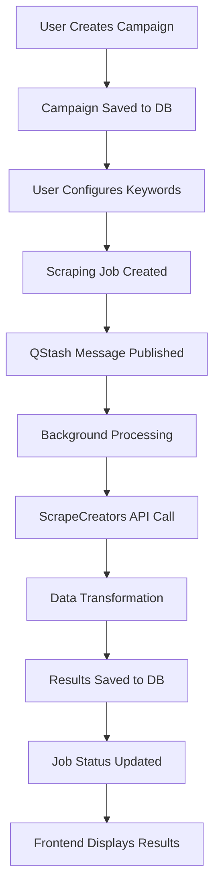

# TikTok Influencer Platform - Complete Technical Documentation

## Overview
This document details the complete end-to-end flow for TikTok influencer campaign creation, background processing, and results display. Use this as a blueprint for implementing similar functionality for other platforms (Instagram, YouTube, etc.).

## Architecture Overview



## Database Schema

### Core Tables
```sql
-- Main campaigns table
campaigns {
  id: uuid (PK)
  userId: uuid
  name: text
  description: text
  searchType: varchar ('keyword' | 'similar')
  status: varchar ('draft' | 'active' | 'completed')
  createdAt: timestamp
  updatedAt: timestamp
}

-- Background processing jobs
scrapingJobs {
  id: uuid (PK)
  userId: text
  campaignId: uuid (FK -> campaigns.id)
  keywords: jsonb (string[])
  platform: varchar ('Tiktok' | 'Instagram')
  status: varchar ('pending' | 'processing' | 'completed' | 'error')
  processedRuns: integer (tracks API calls made)
  processedResults: integer (total creators found)
  targetResults: integer (goal: 100, 500, 1000)
  cursor: integer (pagination for API)
  progress: decimal (0-100)
  timeoutAt: timestamp
  createdAt: timestamp
  updatedAt: timestamp
  error: text
}

-- Final results storage
scrapingResults {
  id: uuid (PK)
  jobId: uuid (FK -> scrapingJobs.id)
  creators: jsonb (CreatorResult[] | InstagramRelatedProfile[])
  createdAt: timestamp
}
```

## Complete End-to-End Flow

### 1. Campaign Creation Flow

#### Frontend: `/app/campaigns/new/page.jsx`
- Renders `CampaignForm` component
- User fills: name, description, search type

#### Component: `/app/components/campaigns/campaign-form.jsx`
```javascript
// Step 1: Basic campaign info
const handleSubmitBasicInfo = (e) => {
  e.preventDefault();
  setStep(2); // Move to search type selection
};

// Step 2: Search type selection
const handleSearchTypeSelection = async (type) => {
  // Create campaign via API
  const response = await fetch('/api/campaigns', {
    method: 'POST',
    body: JSON.stringify({
      name: formData.name,
      description: formData.description,
      searchType: type, // 'keyword' or 'similar'
    }),
  });

  // Save to sessionStorage for next steps
  sessionStorage.setItem('currentCampaign', JSON.stringify(campaign));
  
  // Redirect to search configuration
  router.push('/campaigns/search/keyword');
};
```

#### API: `/app/api/campaigns/route.ts`
```javascript
export async function POST(req: Request) {
  // 1. Authenticate user via Supabase
  const supabase = await createClient();
  const { data: { user } } = await supabase.auth.getUser();
  
  // 2. Create campaign record
  const [campaign] = await db.insert(campaigns).values({
    userId: user.id,
    name,
    description,
    searchType, // 'keyword' | 'similar'
    status: 'draft'
  }).returning();

  return NextResponse.json(campaign);
}
```

### 2. Keyword Configuration Flow

#### Frontend: `/app/campaigns/search/keyword/page.jsx`
```javascript
// Multi-step process:
// Step 1: Platform & creator count selection
// Step 2: Keyword input and review  
// Step 3: Results display

const handleKeywordsSubmit = async (keywords) => {
  const response = await fetch('/api/scraping/tiktok', {
    method: 'POST',
    body: JSON.stringify({
      campaignId: campaignId,
      keywords: keywords, // ['nike', 'fashion', 'sports']
      targetResults: searchData.creatorsCount // 100, 500, or 1000
    }),
  });
  
  const data = await response.json();
  setSearchData(prev => ({ 
    ...prev, 
    jobId: data.jobId // Store for polling
  }));
  setStep(3); // Move to results display
};
```

#### Component: `/app/components/campaigns/keyword-search/keyword-search-form.jsx`
```javascript
// Configures:
// - Platform selection (TikTok checked by default)
// - Creator count slider (100-1000)
// - Validates input before submission
```

### 3. Scraping Job Creation & QStash Integration

#### API: `/app/api/scraping/tiktok/route.ts`
```javascript
export async function POST(req: Request) {
  // 1. Authentication & validation
  const supabase = await createClient();
  const { data: { user } } = await supabase.auth.getUser();
  
  // 2. Parse and validate request
  const { keywords, targetResults, campaignId } = await req.json();
  
  // 3. Verify campaign ownership
  const campaign = await db.query.campaigns.findFirst({
    where: and(
      eq(campaigns.id, campaignId),
      eq(campaigns.userId, user.id)
    )
  });

  // 4. Create scraping job
  const [job] = await db.insert(scrapingJobs).values({
    userId: user.id,
    keywords: sanitizedKeywords,
    targetResults, // 100, 500, or 1000
    status: 'pending',
    platform: 'Tiktok',
    campaignId,
    processedRuns: 0,
    processedResults: 0,
    cursor: 0,
    timeoutAt: new Date(Date.now() + 60 * 60 * 1000) // 1 hour timeout
  }).returning();

  // 5. Publish to QStash for background processing
  const siteUrl = process.env.NEXT_PUBLIC_SITE_URL || process.env.VERCEL_URL;
  const result = await qstash.publishJSON({
    url: `${siteUrl}/api/qstash/process-scraping`,
    body: { jobId: job.id },
    retries: 3,
    notifyOnFailure: true
  });

  return NextResponse.json({
    message: 'Scraping job started successfully',
    jobId: job.id,
    qstashMessageId: result.messageId
  });
}
```

### 4. Background Processing with QStash

#### API: `/app/api/qstash/process-scraping/route.ts`

##### Core Processing Logic
```javascript
export async function POST(req: Request) {
  // 1. Verify QStash signature
  const signature = req.headers.get('Upstash-Signature');
  const body = await req.text();
  const isValid = await receiver.verify({
    signature,
    body,
    url: `${baseUrl}/api/qstash/process-scraping`
  });

  // 2. Extract job ID and fetch job
  const { jobId } = JSON.parse(body);
  const job = await db.query.scrapingJobs.findFirst({
    where: eq(scrapingJobs.id, jobId)
  });

  // 3. Check if job already completed or hit testing limits
  if (job.status === 'completed' || job.status === 'error') {
    return NextResponse.json({ status: job.status });
  }

  // TESTING LIMIT CHECK
  const currentRuns = job.processedRuns || 0;
  if (currentRuns >= MAX_API_CALLS_FOR_TESTING) {
    await db.update(scrapingJobs).set({ 
      status: 'completed',
      completedAt: new Date(),
      error: `Test limit reached: Maximum ${MAX_API_CALLS_FOR_TESTING} API calls made`
    }).where(eq(scrapingJobs.id, jobId));
    return NextResponse.json({ status: 'completed' });
  }

  // 4. Platform-specific processing
  if (job.platform === 'Tiktok') {
    await processTikTokJob(job, jobId);
  } else if (job.platform === 'Instagram') {
    await processInstagramJob(job, jobId);
  }
}
```

##### TikTok-Specific Processing
```javascript
async function processTikTokJob(job, jobId) {
  // 1. Update job status to processing
  await db.update(scrapingJobs).set({ 
    status: 'processing',
    startedAt: new Date(),
    updatedAt: new Date()
  }).where(eq(scrapingJobs.id, jobId));

  // 2. Call ScrapeCreators API
  const keywordQuery = job.keywords.join(', ');
  const apiUrl = `${process.env.SCRAPECREATORS_API_URL}?query=${encodeURIComponent(keywordQuery)}&cursor=${job.cursor || 0}`;
  
  const scrapingResponse = await fetch(apiUrl, {
    method: 'GET',
    headers: {
      'x-api-key': process.env.SCRAPECREATORS_API_KEY!
    }
  });

  const apiResponse = await scrapingResponse.json();

  // 3. Transform API response to match frontend expectations
  const creators = apiResponse.search_item_list.map((item) => {
    const awemeInfo = item.aweme_info || {};
    const author = awemeInfo.author || {};
    const statistics = awemeInfo.statistics || {};
    
    return {
      // Frontend expects: creator.creator?.name
      creator: {
        name: author.nickname || author.unique_id || 'Unknown Creator',
        followers: author.follower_count || 0,
        avatarUrl: (author.avatar_medium?.url_list?.[0] || '').replace('.heic', '.jpeg'),
        profilePicUrl: (author.avatar_medium?.url_list?.[0] || '').replace('.heic', '.jpeg')
      },
      // Frontend expects: creator.video?.description, etc.
      video: {
        description: awemeInfo.desc || 'No description',
        url: awemeInfo.share_url || '',
        statistics: {
          likes: statistics.digg_count || 0,
          comments: statistics.comment_count || 0,
          shares: statistics.share_count || 0,
          views: statistics.play_count || 0
        }
      },
      // Frontend expects: creator.hashtags
      hashtags: awemeInfo.text_extra
        ?.filter((extra) => extra.type === 1 && extra.hashtag_name)
        ?.map((extra) => extra.hashtag_name) || [],
      // Additional metadata
      createTime: awemeInfo.create_time || Date.now() / 1000,
      platform: 'TikTok',
      keywords: job.keywords || []
    };
  });

  // 4. Save results to database
  await db.insert(scrapingResults).values({
    jobId: job.id,
    creators: creators,
    createdAt: new Date()
  });

  // 5. Update job progress
  const newProcessedRuns = (job.processedRuns || 0) + 1;
  const totalProcessedResults = (job.processedResults || 0) + creators.length;
  
  await db.update(scrapingJobs).set({ 
    processedRuns: newProcessedRuns,
    processedResults: totalProcessedResults,
    updatedAt: new Date()
  }).where(eq(scrapingJobs.id, jobId));

  // 6. Check if we should continue or complete
  if (newProcessedRuns >= MAX_API_CALLS_FOR_TESTING || 
      totalProcessedResults >= job.targetResults) {
    // Complete the job
    await db.update(scrapingJobs).set({ 
      status: 'completed',
      completedAt: new Date(),
      progress: '100'
    }).where(eq(scrapingJobs.id, jobId));
  } else {
    // Schedule next API call
    await qstash.publishJSON({
      url: `${baseUrl}/api/qstash/process-scraping`,
      body: { jobId: job.id },
      delay: '2s', // Short delay between calls
      retries: 3,
      notifyOnFailure: true
    });
  }
}
```

### 5. Results Display & Polling

#### Frontend: `/app/components/campaigns/keyword-search/search-results.jsx`
```javascript
// Polls for job completion
useEffect(() => {
  const fetchResults = async () => {
    const response = await fetch(`/api/scraping/tiktok?jobId=${searchData.jobId}`);
    const data = await response.json();

    if (data.status === 'completed') {
      // Combine all creators from all results
      const allCreators = data.results?.reduce((acc, result) => {
        return [...acc, ...(result.creators || [])];
      }, []) || [];
      
      setCreators(allCreators);
      setIsLoading(false);
    }
  };

  const interval = setInterval(fetchResults, 3000); // Poll every 3 seconds
  return () => clearInterval(interval);
}, [searchData.jobId]);
```

#### API: `/app/api/scraping/tiktok/route.ts` (GET)
```javascript
export async function GET(req: Request) {
  const { searchParams } = new URL(req.url);
  const jobId = searchParams.get('jobId');

  // Get job with results
  const job = await db.query.scrapingJobs.findFirst({
    where: eq(scrapingJobs.id, jobId),
    with: {
      results: {
        columns: {
          id: true,
          jobId: true,
          creators: true,
          createdAt: true
        }
      }
    }
  });

  // Check for timeouts and stalled jobs
  if (job.timeoutAt && new Date(job.timeoutAt) < new Date()) {
    if (job.status === 'processing' || job.status === 'pending') {
      await db.update(scrapingJobs).set({ 
        status: 'timeout',
        error: 'Job exceeded maximum allowed time'
      }).where(eq(scrapingJobs.id, jobId));
    }
  }

  return NextResponse.json({
    status: job.status,
    processedResults: job.processedResults,
    targetResults: job.targetResults,
    error: job.error,
    results: job.results,
    progress: parseFloat(job.progress || '0')
  });
}
```

### 6. Image Proxying System

#### API: `/app/api/proxy/image/route.ts`
```javascript
export async function GET(request: Request) {
  const { searchParams } = new URL(request.url);
  const imageUrl = searchParams.get('url');

  // Fetch image with proper headers
  const response = await fetch(imageUrl, {
    headers: {
      'User-Agent': 'Mozilla/5.0 (Windows NT 10.0; Win64; x64) AppleWebKit/537.36',
    }
  });

  const arrayBuffer = await response.arrayBuffer();
  let buffer = Buffer.from(arrayBuffer);
  let contentType = response.headers.get('content-type') || 'image/jpeg';

  // Return proxied image with CORS headers
  return new NextResponse(buffer, {
    headers: {
      'Content-Type': contentType,
      'Cache-Control': 'public, max-age=3600',
      'Access-Control-Allow-Origin': '*',
    },
  });
}
```

## Key Configuration Files

### Environment Variables
```bash
# Database
DATABASE_URL="postgresql://..."
NEXT_PUBLIC_SUPABASE_URL=https://xxx.supabase.co
SUPABASE_SERVICE_ROLE_KEY=xxx

# QStash (Background Processing)
QSTASH_URL=https://qstash.upstash.io
QSTASH_TOKEN=xxx
QSTASH_CURRENT_SIGNING_KEY=xxx
QSTASH_NEXT_SIGNING_KEY=xxx

# External APIs
SCRAPECREATORS_API_URL=https://api.scrapecreators.com/v1/tiktok/search/keyword
SCRAPECREATORS_API_KEY=xxx

# Deployment
NEXT_PUBLIC_SITE_URL=https://your-app.vercel.app
VERCEL_URL=your-app.vercel.app
```

### QStash Configuration: `/lib/queue/qstash.ts`
```javascript
import { Client } from "@upstash/qstash";

export const qstash = new Client({
  token: process.env.QSTASH_TOKEN!,
});
```

### Database Connection: `/lib/db/index.ts`
```javascript
import { drizzle } from 'drizzle-orm/postgres-js';
import postgres from 'postgres';
import * as schema from './schema';

const client = postgres(process.env.DATABASE_URL!);
export const db = drizzle(client, { schema });
```

## Testing & Development Configuration

### Testing Limits
```javascript
// In /app/api/qstash/process-scraping/route.ts
const MAX_API_CALLS_FOR_TESTING = 1; // Limits to 1 API call for testing

// For production, either:
// 1. Set to high number: const MAX_API_CALLS_FOR_TESTING = 999;
// 2. Or remove the limit check entirely
```

### Local Development with QStash
```bash
# Option 1: Use ngrok tunnel
ngrok http 3000
# Update NEXT_PUBLIC_SITE_URL to ngrok URL

# Option 2: Use Vercel dev
vercel dev
# QStash can reach vercel dev URLs
```

## YouTube Implementation (Complete Integration)

### 1. Modular Platform Architecture

YouTube integration follows a clean modular approach with completely separate platform handlers:

```
lib/platforms/youtube/
├── types.ts           # YouTube-specific TypeScript interfaces
├── api.ts            # YouTube API calls (keyword & hashtag search)
├── transformer.ts    # YouTube data transformation to common format
└── handler.ts        # YouTube background processing logic
```

### 2. YouTube API Integration

#### API Endpoints Used
- **Keyword Search**: `https://api.scrapecreators.com/v1/youtube/search`
- **Hashtag Search**: `https://api.scrapecreators.com/v1/youtube/search/hashtag`

#### YouTube API Response Structure
```javascript
{
  "videos": [
    {
      "type": "video",
      "id": "BzSzwqb-OEE",
      "url": "https://www.youtube.com/watch?v=BzSzwqb-OEE",
      "title": "NF - RUNNING (Audio)",
      "thumbnail": "https://i.ytimg.com/vi/BzSzwqb-OEE/hq720.jpg",
      "channel": {
        "id": "UCoRR6OLuIZ2-5VxtnQIaN2w",
        "title": "NFrealmusic",
        "thumbnail": "https://yt3.ggpht.com/..."
      },
      "viewCountText": "14,860,541 views",
      "viewCountInt": 14860541,
      "publishedTimeText": "2 years ago",
      "publishedTime": "2023-05-28T17:08:46.499Z",
      "lengthText": "4:14",
      "lengthSeconds": 254
    }
  ]
}
```

### 3. Complete Backend Implementation

#### YouTube API Endpoint (`/app/api/scraping/youtube/route.ts`)
```javascript
export async function POST(req: Request) {
  // 1. Authenticate user via Supabase
  const supabase = await createClient();
  const { data: { user } } = await supabase.auth.getUser();
  
  // 2. Parse and validate request
  const { keywords, targetResults, campaignId } = await req.json();
  
  // 3. Create YouTube scraping job
  const [job] = await db.insert(scrapingJobs).values({
    userId: user.id,
    keywords: sanitizedKeywords,
    targetResults,
    status: 'pending',
    platform: 'YouTube', // YouTube platform identifier
    campaignId,
    processedRuns: 0,
    processedResults: 0,
    cursor: 0,
    timeoutAt: new Date(Date.now() + 60 * 60 * 1000)
  }).returning();

  // 4. Publish to QStash for background processing
  const result = await qstash.publishJSON({
    url: `${siteUrl}/api/qstash/process-scraping`,
    body: { jobId: job.id },
    retries: 3,
    notifyOnFailure: true
  });

  return NextResponse.json({
    message: 'YouTube scraping job started successfully',
    jobId: job.id,
    qstashMessageId: result.messageId
  });
}

export async function GET(req: Request) {
  // Same job status polling logic as TikTok
  const { searchParams } = new URL(req.url);
  const jobId = searchParams.get('jobId');
  
  const job = await db.query.scrapingJobs.findFirst({
    where: eq(scrapingJobs.id, jobId),
    with: { results: true }
  });

  return NextResponse.json({
    status: job.status,
    processedResults: job.processedResults,
    targetResults: job.targetResults,
    results: job.results,
    progress: parseFloat(job.progress || '0')
  });
}
```

#### QStash Background Processing Integration
```javascript
// In /app/api/qstash/process-scraping/route.ts
import { processYouTubeJob } from '@/lib/platforms/youtube/handler';

// Added YouTube case without modifying existing TikTok logic
else if (job.platform === 'YouTube') {
  console.log('🎬 Processing YouTube job for keywords:', job.keywords);
  
  try {
    const result = await processYouTubeJob(job, jobId);
    return NextResponse.json(result);
  } catch (youtubeError) {
    // Error handling and job status updates
    await db.update(scrapingJobs).set({ 
      status: 'error', 
      error: youtubeError.message,
      completedAt: new Date()
    }).where(eq(scrapingJobs.id, jobId));
    
    throw youtubeError;
  }
}
```

### 4. YouTube Background Processing Logic

#### YouTube Handler (`/lib/platforms/youtube/handler.ts`)
```javascript
export async function processYouTubeJob(job: any, jobId: string) {
  // Same testing limits as TikTok
  const MAX_API_CALLS_FOR_TESTING = 1;
  
  // Check testing limits
  const currentRuns = job.processedRuns || 0;
  if (currentRuns >= MAX_API_CALLS_FOR_TESTING) {
    await db.update(scrapingJobs).set({ 
      status: 'completed',
      error: `Test limit reached: Maximum ${MAX_API_CALLS_FOR_TESTING} API calls made`
    }).where(eq(scrapingJobs.id, jobId));
    return { status: 'completed' };
  }

  // Update job to processing
  await db.update(scrapingJobs).set({ 
    status: 'processing',
    startedAt: new Date()
  }).where(eq(scrapingJobs.id, jobId));

  // Call YouTube API
  const searchParams = {
    keywords: job.keywords,
    mode: 'keyword'
  };
  
  const youtubeResponse = await searchYouTube(searchParams);
  
  // Transform and save results
  const creators = transformYouTubeVideos(youtubeResponse.videos, job.keywords);
  
  await db.insert(scrapingResults).values({
    jobId: job.id,
    creators: creators,
    createdAt: new Date()
  });

  // Update completion status
  const newProcessedRuns = currentRuns + 1;
  if (newProcessedRuns >= MAX_API_CALLS_FOR_TESTING) {
    await db.update(scrapingJobs).set({ 
      status: 'completed',
      processedRuns: newProcessedRuns,
      processedResults: creators.length,
      progress: '100'
    }).where(eq(scrapingJobs.id, jobId));
    
    return { status: 'completed', processedRuns: newProcessedRuns };
  }
  
  // Schedule next API call if needed
  await qstash.publishJSON({
    url: `${baseUrl}/api/qstash/process-scraping`,
    body: { jobId: job.id },
    delay: '2s'
  });
  
  return { status: 'processing', processedRuns: newProcessedRuns };
}
```

### 5. YouTube Data Transformation

#### YouTube to Common Format Transformation
```javascript
// lib/platforms/youtube/transformer.ts
export function transformYouTubeVideo(video, keywords = []) {
  // Extract hashtags from title and description
  const titleHashtags = extractHashtags(video.title || '');
  const descriptionHashtags = extractHashtags(video.description || '');
  const allHashtags = [...new Set([...titleHashtags, ...descriptionHashtags])];
  
  return {
    // Frontend expects: creator.creator?.name
    creator: {
      name: video.channel?.title || 'Unknown Channel',
      followers: 0, // Not available in YouTube search API
      avatarUrl: video.channel?.thumbnail || '',
      profilePicUrl: video.channel?.thumbnail || ''
    },
    // Frontend expects: creator.video?.description, etc.
    video: {
      description: video.title || 'No title',
      url: video.url || '',
      statistics: {
        likes: 0, // Not available in YouTube search API
        comments: 0, // Not available in YouTube search API
        shares: 0, // Not available in YouTube search API
        views: video.viewCountInt || 0 // ✅ Available
      }
    },
    // Frontend expects: creator.hashtags
    hashtags: allHashtags,
    // Metadata
    createTime: Math.floor(new Date(video.publishedTime).getTime() / 1000),
    platform: 'YouTube',
    keywords: keywords,
    // YouTube-specific fields
    publishedTime: video.publishedTime || '',
    lengthSeconds: video.lengthSeconds || 0,
    channelId: video.channel?.id || ''
  };
}
```

### 6. Frontend Integration

#### Platform Selection Update
```javascript
// app/components/campaigns/keyword-search/keyword-search-form.jsx
<div className="flex space-x-4">
  <div className="flex items-center">
    <Checkbox
      checked={selectedPlatforms.includes("tiktok")}
      onCheckedChange={() => handlePlatformChange("tiktok")}
    />
    <span className="ml-2">TikTok</span>
  </div>
  <div className="flex items-center">
    <Checkbox
      checked={selectedPlatforms.includes("youtube")}
      onCheckedChange={() => handlePlatformChange("youtube")}
    />
    <span className="ml-2">YouTube</span>
  </div>
</div>
```

#### Dynamic API Routing
```javascript
// app/campaigns/search/keyword/page.jsx
const handleKeywordsSubmit = async (keywords) => {
  // Determine API endpoint based on selected platform
  let apiEndpoint = '/api/scraping/tiktok'; // Default
  if (searchData.platforms.includes('youtube')) {
    apiEndpoint = '/api/scraping/youtube';
  }

  const response = await fetch(apiEndpoint, {
    method: 'POST',
    body: JSON.stringify({
      campaignId: campaignId,
      keywords: keywords,
      targetResults: searchData.creatorsCount
    }),
  });
  
  setSearchData(prev => ({ 
    ...prev, 
    keywords,
    jobId: data.jobId,
    selectedPlatform: searchData.platforms.includes('youtube') ? 'youtube' : 'tiktok'
  }));
};
```

#### Optimized Results Display
```javascript
// app/components/campaigns/keyword-search/search-results.jsx
// Updated table structure for YouTube data
<TableHeader>
  <TableRow>
    <TableHead>Profile</TableHead>
    <TableHead>Creator Name</TableHead>
    <TableHead>Date</TableHead>
    <TableHead>Video Title</TableHead>
    <TableHead>Views</TableHead>
    <TableHead>Duration</TableHead>
    <TableHead>Link</TableHead>
  </TableRow>
</TableHeader>

// Dynamic API endpoint selection
const fetchResults = async () => {
  const apiEndpoint = searchData.selectedPlatform === 'youtube' ? 
    '/api/scraping/youtube' : 
    '/api/scraping/tiktok';
  
  const response = await fetch(`${apiEndpoint}?jobId=${searchData.jobId}`);
  // Process results...
};

// Duration formatting
const formatDuration = (seconds) => {
  if (!seconds) return 'N/A';
  const hours = Math.floor(seconds / 3600);
  const minutes = Math.floor((seconds % 3600) / 60);
  const remainingSeconds = seconds % 60;
  
  if (hours > 0) {
    return `${hours}:${minutes.toString().padStart(2, '0')}:${remainingSeconds.toString().padStart(2, '0')}`;
  } else {
    return `${minutes}:${remainingSeconds.toString().padStart(2, '0')}`;
  }
};
```

### 7. Data Availability Comparison

#### YouTube vs TikTok Data Availability
```javascript
// YouTube available data
{
  creator: { 
    name: "✅ Channel title", 
    avatarUrl: "✅ Channel thumbnail",
    followers: "❌ Not available in search API"
  },
  video: { 
    description: "✅ Video title",
    url: "✅ Video URL",
    statistics: {
      views: "✅ View count",
      likes: "❌ Not available in search API",
      comments: "❌ Not available in search API", 
      shares: "❌ Not available in search API"
    }
  },
  publishedTime: "✅ Upload date",
  lengthSeconds: "✅ Video duration",
  hashtags: "⚠️ Only if present in title/description"
}

// TikTok available data  
{
  creator: { 
    name: "✅ Creator nickname",
    avatarUrl: "✅ Profile picture", 
    followers: "✅ Follower count"
  },
  video: { 
    description: "✅ Video description",
    url: "✅ Share URL",
    statistics: {
      views: "✅ Play count",
      likes: "✅ Like count", 
      comments: "✅ Comment count",
      shares: "✅ Share count"
    }
  },
  hashtags: "✅ Extracted hashtags",
  createTime: "✅ Creation timestamp"
}
```

### 8. Environment Configuration

```bash
# YouTube API Configuration
SCRAPECREATORS_API_KEY=xxx  # Same key as TikTok
# YouTube endpoints are hardcoded in api.ts:
# - https://api.scrapecreators.com/v1/youtube/search
# - https://api.scrapecreators.com/v1/youtube/search/hashtag

# Same QStash and database configuration as TikTok
QSTASH_TOKEN=xxx
DATABASE_URL=xxx
```

### 9. Testing Configuration

```javascript
// Same testing limits as TikTok
const MAX_API_CALLS_FOR_TESTING = 1;

// Local development with ngrok
NEXT_PUBLIC_SITE_URL=https://your-ngrok-url.ngrok-free.app

// Same QStash callback pattern
${siteUrl}/api/qstash/process-scraping
```

### 10. Key Implementation Benefits

1. **Zero Impact on TikTok**: All existing TikTok logic remains completely untouched
2. **Modular Architecture**: YouTube handler is completely self-contained in `lib/platforms/youtube/`
3. **Same Testing Flow**: Identical 1 API call limit and local development experience
4. **Reusable Components**: Frontend components work for both platforms with dynamic routing
5. **Optimized Data Display**: Table shows only relevant YouTube data (removed irrelevant columns)
6. **Same Background Processing**: Uses identical QStash pattern as TikTok

## Implementation Guide for Other Platforms (Instagram)

### 1. Database Changes
```sql
-- Add new platform option
ALTER TABLE scraping_jobs 
ALTER COLUMN platform TYPE varchar(50);
-- Now supports 'Tiktok' | 'Instagram' | 'YouTube' etc.

-- Add platform-specific fields if needed
ALTER TABLE scraping_jobs 
ADD COLUMN target_username text; -- For Instagram similar search
```

### 2. API Endpoint Structure
```
/app/api/scraping/instagram/route.ts (similar to tiktok/route.ts)
├── POST: Create Instagram scraping job
└── GET: Check Instagram job status
```

### 3. QStash Processing Updates
```javascript
// In process-scraping/route.ts, add Instagram handler:
if (job.platform === 'Instagram') {
  await processInstagramJob(job, jobId);
}

async function processInstagramJob(job, jobId) {
  // 1. Call Instagram API (different endpoint)
  const apiUrl = `${process.env.SCRAPECREATORS_INSTAGRAM_API_URL}?handle=${job.targetUsername}`;
  
  // 2. Transform Instagram response format
  const creators = instagramData.data.user.edge_related_profiles.edges.map(edge => ({
    creator: {
      name: edge.node.full_name,
      followers: edge.node.follower_count || 0,
      // Instagram-specific transformation
    }
  }));
  
  // 3. Same save/update logic as TikTok
}
```

### 4. Frontend Components
```
/app/campaigns/search/instagram/page.jsx
/app/components/campaigns/instagram-search/
├── instagram-search-form.jsx
├── instagram-review.jsx
└── instagram-results.jsx
```

### 5. Data Transformation Differences
```javascript
// TikTok format
{
  creator: { name, followers, avatarUrl },
  video: { description, statistics: { likes, comments, shares } },
  hashtags: []
}

// Instagram format  
{
  creator: { name, followers, profilePicUrl },
  post: { caption, statistics: { likes, comments } },
  tags: []
}

// YouTube format
{
  creator: { name, avatarUrl }, // No followers available
  video: { description, statistics: { views } }, // Only views available
  hashtags: [], // Extracted from title if present
  lengthSeconds: 254, // Video duration
  publishedTime: "2023-05-28T17:08:46.499Z"
}
```

## Error Handling & Monitoring

### Common Error Scenarios
1. **QStash signature verification fails**: Check signing keys
2. **External API rate limits**: Implement exponential backoff
3. **Job timeouts**: Set appropriate timeout values
4. **Image proxy failures**: Graceful fallbacks for missing images

### Monitoring Points
1. **Job completion rates**: Track failed vs successful jobs
2. **API response times**: Monitor external API performance
3. **QStash delivery**: Track message delivery success
4. **Image proxy performance**: Monitor proxy response times

## Performance Optimizations

### 1. Database Indexing
```sql
CREATE INDEX idx_scraping_jobs_user_id ON scraping_jobs(user_id);
CREATE INDEX idx_scraping_jobs_status ON scraping_jobs(status);
CREATE INDEX idx_scraping_results_job_id ON scraping_results(job_id);
```

### 2. Caching Strategy
- Image proxy: 1 hour cache
- Job status: No cache (real-time updates needed)
- Campaign list: 1 minute cache

### 3. QStash Optimization
- Batch multiple API calls when possible
- Use appropriate delays between calls (2-5 seconds)
- Set reasonable retry limits (3-5 retries)

## Security Considerations

### 1. Authentication
- All API endpoints verify user authentication
- Campaign ownership validation before job creation
- QStash signature verification for webhook security

### 2. Rate Limiting
- Testing limits prevent excessive API usage
- User-based rate limiting in production
- External API key management

### 3. Data Privacy
- User data isolation by userId
- Secure storage of API keys
- Image proxy doesn't store images permanently

---

This documentation provides a complete blueprint for understanding and extending the TikTok influencer platform to support additional social media platforms.