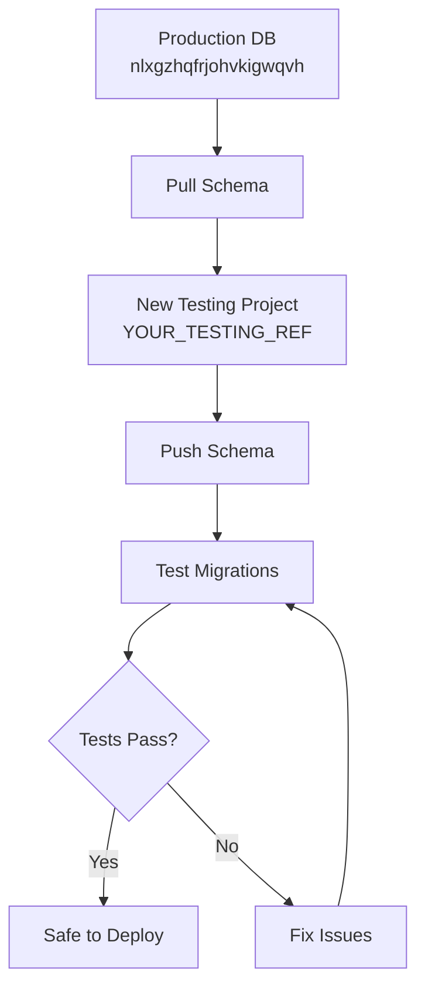

# Testing Environment Workflow for Admin Panel WT2 Branch

## Overview
This guide helps you safely test the admin panel WT2 branch features using a cloned Supabase testing environment, ensuring your production database stays safe.

## 🎯 Testing Strategy



## 🚀 Quick Start

### Step 1: Run Setup Script
```bash
./setup-testing-environment.sh
```

### Step 2: Create New Supabase Project
1. Go to [Supabase Dashboard](https://supabase.com/dashboard)
2. Click "New Project"
3. Name: `influencer-platform-testing`
4. **Same region** as your production project
5. Copy the project reference ID (e.g., `cufwvosytcmaggyyfsix`)

### Step 3: Link and Push Schema
```bash
# Link to your new testing project
supabase link --project-ref YOUR_TESTING_PROJECT_REF

# Push the production schema to testing
supabase db push
```

### Step 4: Configure Testing Environment
```bash
# Copy the template
cp .env.testing.template .env.testing

# Edit .env.testing with your testing project values:
# - NEXT_PUBLIC_SUPABASE_URL
# - SUPABASE_SERVICE_ROLE_KEY  
# - NEXT_PUBLIC_SUPABASE_ANON_KEY
# - DATABASE_URL
```

## 📋 Current Migration Files to Test

Based on your git status, you have these migrations to test:

### 1. **Temporary Test Migration** (`0014_temp_migrate_test.sql`)
```sql
CREATE TABLE IF NOT EXISTS temp_migrate_test (
  id uuid PRIMARY KEY DEFAULT gen_random_uuid(),
  note text,
  created_at timestamp DEFAULT now() NOT NULL
);
```

### 2. **Cleanup Migration** (`0015_drop_temp_migrate_test.sql`)
```sql
DROP TABLE IF EXISTS temp_migrate_test;
```

## 🧪 Testing Process

### Phase 1: Validate Basic Setup
```bash
# Switch to testing environment
export NODE_ENV=testing
cp .env.testing .env.local

# Verify database connection
npm run dev
# Check if app loads and connects to testing DB
```

### Phase 2: Test Migration Files
```bash
# Test the temp migration
supabase db push

# Verify table was created
# Check Supabase Dashboard > Table Editor

# Test the cleanup migration
# This should remove the temp table
```

### Phase 3: Test Admin Panel Features
Based on your modified files, test:

1. **Billing Status API** (`app/api/billing/status/route.ts`)
   - Verify billing status endpoints work
   - Test with test user data

2. **Campaign Creation API** (`app/api/campaigns/can-create/route.ts`)
   - Test campaign creation limits
   - Verify plan validation

3. **Usage Summary API** (`app/api/usage/summary/route.ts`)
   - Check usage tracking
   - Verify data aggregation

4. **Plan Validator Service** (`lib/services/plan-validator.ts`)
   - Test plan limits
   - Verify feature restrictions

## 🔍 Verification Checklist

### Database Health Check
- [ ] Testing project has same schema as production
- [ ] All tables present and accessible
- [ ] Migrations run without errors
- [ ] No data conflicts or corruption

### API Endpoints Check
- [ ] `/api/billing/status` responds correctly
- [ ] `/api/campaigns/can-create` enforces limits
- [ ] `/api/usage/summary` returns valid data
- [ ] Authentication works with test users

### Admin Panel Features Check
- [ ] Admin authentication works
- [ ] User management functions
- [ ] Plan validation enforces correctly
- [ ] Email testing system operational

## 🔧 Environment Switching

### Switch to Testing
```bash
cp .env.testing .env.local
npm run dev
```

### Switch Back to Production  
```bash
cp .env.local.backup .env.local  # if you backed up original
# Or manually restore production values
npm run dev
```

## 🚨 Safety Measures

### Before Testing
1. ✅ **Backup production .env.local**
2. ✅ **Verify you're connected to testing DB**
3. ✅ **Double-check project references**

### During Testing
1. 🔍 **Monitor testing database only**
2. 🔍 **Never mix production and testing credentials**
3. 🔍 **Use test user accounts only**

### After Testing
1. 🧹 **Clean up test data if needed**
2. 🧹 **Restore production environment**
3. 🧹 **Document any issues found**

## 🎭 Test Scenarios for Admin Panel WT2

### Scenario 1: Plan Validation Testing
```javascript
// Test different user plans
TEST_USER_PLANS = ['free', 'glow_up', 'viral_surge', 'fame_flex']

// For each plan, test:
// - Campaign creation limits
// - Feature access restrictions  
// - Usage tracking accuracy
```

### Scenario 2: Billing Integration Testing
```javascript
// Test billing status for different user states
TEST_BILLING_STATES = [
  'trial_active',
  'trial_expired', 
  'subscription_active',
  'subscription_cancelled'
]
```

### Scenario 3: Admin Features Testing
```javascript
// Test admin panel functionality
TEST_ADMIN_FEATURES = [
  'user_management',
  'plan_upgrades',
  'usage_monitoring',
  'email_testing'
]
```

## 🐛 Troubleshooting

### Common Issues

**Issue: Migration fails with "relation already exists"**
```bash
# Solution: Reset migrations in testing
supabase db reset
supabase db push
```

**Issue: Environment variables not loading**
```bash
# Solution: Restart dev server
npm run dev
```

**Issue: Can't connect to testing database**
```bash
# Solution: Verify credentials in .env.testing
# Check Supabase project settings
```

## 📊 Testing Metrics to Track

### Performance Metrics
- API response times with testing data
- Database query performance
- Migration execution time

### Functionality Metrics  
- Feature availability per plan
- Error rates in admin functions
- User onboarding success rates

### Data Integrity Metrics
- Billing status accuracy
- Usage calculation correctness
- Plan limit enforcement

## 🎯 Success Criteria

### Ready to Deploy When:
- [ ] All migrations run successfully
- [ ] No API errors in testing environment
- [ ] Admin panel features work as expected
- [ ] Plan validation enforces correctly
- [ ] No data corruption or loss
- [ ] Performance metrics within acceptable range

---

## 🔄 Quick Commands Reference

```bash
# Setup testing environment
./setup-testing-environment.sh

# Link to testing project  
supabase link --project-ref YOUR_TESTING_REF

# Push schema to testing
supabase db push

# Switch to testing
cp .env.testing .env.local

# Run tests
npm run dev

# Switch back to production
git checkout .env.local  # if tracked, or restore manually
```

This workflow ensures your admin panel WT2 features are thoroughly tested before any production deployment!