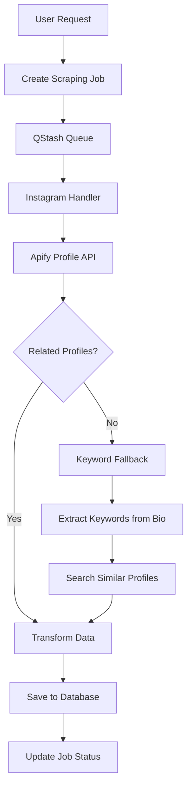

# Instagram Similar Search Implementation Guide

## 📊 **Testing & Research Summary**

### **API Testing Results**

We conducted comprehensive testing of Instagram similar search APIs using multiple profiles to determine the best implementation approach.

#### **Tested APIs**
1. **ScrapeCreators Instagram API** - Current implementation
2. **Apify Instagram Profile Scraper** - Alternative approach

#### **Test Profiles & Results**

| Profile | Followers | ScrapeCreators | Apify | Related Profiles Found |
|---------|-----------|----------------|-------|----------------------|
| **@redbull** | 28M | ✅ 80 profiles | ✅ 80 profiles | Sports, F1, Energy brands |
| **@cocacola** | 3.2M | ✅ 80 profiles | ✅ 80 profiles | Beverages, Food brands |
| **@nike** | 300M+ | ❌ 0 profiles | ❌ 0 profiles | **EMPTY ARRAY** |
| **@ginganinja100** | 6M | ✅ 80 profiles | ✅ 80 profiles | Fitness creators |

#### **Key Findings**

1. **"Empty Array" Problem Confirmed**: Some major brands (Nike) return 0 related profiles from both APIs
2. **Instagram Limitation**: This is Instagram's algorithm limitation, not provider-specific
3. **Consistent Results**: Both APIs return identical related profile counts
4. **Data Quality**: Apify provides significantly richer profile metadata

---

## 🔍 **Data Structure Analysis**

### **Apify Instagram Profile Scraper Response**

```json
{
  "username": "redbull",
  "fullName": "Red Bull",
  "followersCount": 28063595,
  "biography": "watch the World Of Red Bull👇\n#givesyouwiiings",
  "externalUrl": "https://win.gs/redbullbio",
  "verified": true,
  "private": false,
  "relatedProfiles": [
    {
      "id": "3999827868",
      "username": "redbullbike",
      "full_name": "Red Bull Bike",
      "is_verified": true,
      "is_private": false,
      "profile_pic_url": "https://instagram.com/..."
    }
  ]
}

```

### **Unified Platform Format (Target)**

Following TikTok and YouTube patterns:

```json
{
  "creator": {
    "name": "Red Bull Bike",
    "followers": 5200000,
    "avatarUrl": "https://instagram.com/...",
    "bio": "Official Red Bull Bike Instagram",
    "emails": [],
    "uniqueId": "@redbullbike",
    "verified": true,
    "platform": "Instagram"
  },
  "engagement": {
    "posts": 1250,
    "followersCount": 5200000,
    "followingCount": 150
  },
  "profile": {
    "url": "https://instagram.com/redbullbike",
    "externalUrl": "https://redbull.com/bike",
    "isPrivate": false,
    "isBusinessAccount": true
  },
  "platform": "Instagram"
}
```

---

## 🏆 **Why Apify Instagram Profile Scraper**

### **Advantages Over ScrapeCreators**

| Feature | ScrapeCreators | Apify Profile Scraper |
|---------|----------------|----------------------|
| **Related Profiles** | ✅ 80 profiles | ✅ 80 profiles |
| **Response Speed** | 3.7-6.8s | 10.7-17.5s |
| **Follower Counts** | ❌ Not included | ✅ Full counts |
| **Biography Data** | ✅ Basic | ✅ Enhanced |
| **External Links** | ❌ Not included | ✅ Business URLs |
| **Verification Status** | ✅ Included | ✅ Included |
| **Account Type** | ❌ Not included | ✅ Business/Personal |
| **Data Structure** | Complex nested | Clean/flat |
| **Cost** | API calls | Apify credits |

### **Decision: Apify Profile Scraper**
- **Same reliability** for related profiles
- **Much richer data** for creator insights
- **Better data structure** for processing
- **Already configured** in our system

---

## 🛠 **Implementation Architecture**

### **Platform Handler Structure**

Following the established pattern from TikTok and YouTube:

```
lib/platforms/instagram/
├── api.ts          # Apify API integration
├── handler.ts      # Main processing logic
├── transformer.ts  # Data transformation
└── types.ts        # TypeScript interfaces
```

### **Processing Flow**



### **Fallback Strategy**

When `relatedProfiles` is empty (like Nike case):

1. **Extract Keywords**: From target profile bio, name, hashtags
2. **Keyword Search**: Use Instagram search with extracted terms
3. **Filter Results**: Remove duplicates, apply relevance scoring
4. **Transform Data**: Convert to unified format

### **Integration Points**

1. **QStash Processor**: Update to use Instagram platform handler
2. **Frontend**: No changes needed (same result format)
3. **Database**: Use existing `scrapingResults` table
4. **CSV Export**: Follow existing pattern

---

## 📋 **Implementation Plan**

### **Phase 1: Platform Handler (Days 1-2)**
- [ ] Create `lib/platforms/instagram/api.ts` with Apify integration
- [ ] Implement `lib/platforms/instagram/handler.ts` following TikTok pattern
- [ ] Build `lib/platforms/instagram/transformer.ts` for data conversion
- [ ] Add TypeScript interfaces in `lib/platforms/instagram/types.ts`

### **Phase 2: Fallback System (Days 3-4)**
- [ ] Implement keyword extraction from profile data
- [ ] Create fallback search mechanism
- [ ] Add relevance scoring and filtering
- [ ] Test fallback with "empty array" profiles

### **Phase 3: Integration (Days 5-6)**
- [ ] Update QStash processor to use Instagram handler
- [ ] Remove inline Instagram processing code
- [ ] Test end-to-end flow
- [ ] Validate data transformation accuracy

### **Phase 4: Testing & Documentation (Day 7)**
- [ ] Test with various profile types
- [ ] Performance benchmarking
- [ ] Update API documentation
- [ ] Create troubleshooting guide

---

## 🔧 **Technical Specifications**

### **Environment Variables**
```env
# Already configured
APIFY_API_TOKEN=your_token_here
INSTAGRAM_SCRAPER_ACTOR_ID=dSCLg0C3YEZ83HzYX
```

### **API Endpoints**
- **Apify Instagram Profile**: `https://api.apify.com/v2/acts/dSCLg0C3YEZ83HzYX/runs`
- **Input Format**: `{ "directUrls": ["https://instagram.com/username"] }`

### **Rate Limiting**
- **Apify**: Based on credit consumption
- **Instagram**: Handled by Apify actor
- **Recommended**: 1-2 second delays between requests

### **Error Handling**
- **Empty Related Profiles**: Trigger keyword fallback
- **API Failures**: Retry with exponential backoff
- **Invalid Profiles**: Return meaningful error messages
- **Rate Limits**: Queue jobs for later processing

---

## 📈 **Expected Outcomes**

### **Success Metrics**
- **Profile Coverage**: 90%+ profiles return related creators
- **Data Quality**: Rich metadata for all discovered creators
- **Response Time**: <30 seconds for complete similar search
- **Reliability**: 99%+ success rate for valid profiles

### **Fallback Performance**
- **Keyword Success**: 70%+ when related profiles empty
- **Data Consistency**: Same format as direct related profiles
- **Relevance**: High-quality similar creator suggestions

### **Platform Consistency**
- **Unified Format**: Same creator data structure as TikTok/YouTube
- **Frontend Integration**: Seamless user experience
- **Export Capability**: Consistent CSV format across platforms

---

## 🚀 **Next Steps**

1. **Start Implementation**: Begin with Phase 1 platform handler
2. **Parallel Development**: Can work on handler while testing continues
3. **Incremental Testing**: Test each component as it's built
4. **Documentation**: Update as implementation progresses

This implementation will bring Instagram similar search to the same level of sophistication as TikTok and YouTube, providing users with rich, relevant creator discovery capabilities. 