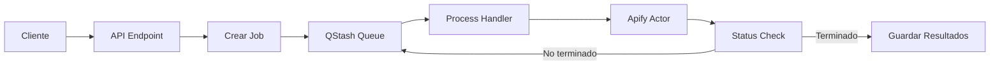

# QStash: Lecciones Aprendidas y Mejores Prácticas

## 1. Problemas Comunes y Soluciones

### 1.1 Error: "Body has already been read"
**Problema:** Al intentar leer el cuerpo de una petición más de una vez en Next.js.

**Causa:**
- En Node.js/Next.js, el cuerpo de una petición solo puede leerse una vez
- Intentar usar `req.text()` o `req.json()` múltiples veces causa este error

**Solución:**
```typescript
// ❌ Mal
const isValid = await receiver.verify({
  signature,
  body: await req.text(),  // Primera lectura
  url: '...'
})
const data = await req.json()  // ¡Error! Body ya fue leído

// ✅ Bien
const body = await req.text()  // Leer una sola vez
const isValid = await receiver.verify({
  signature,
  body,
  url: '...'
})
const data = JSON.parse(body)  // Reutilizar el body
```

### 1.2 Timeout en Vercel
**Problema:** Las funciones serverless de Vercel tienen un límite de 10 segundos.

**Causa:**
- Intentar hacer todo el proceso de scraping en una sola petición
- No usar un sistema de colas para procesos largos

**Solución:** Dividir el proceso en múltiples pasos:
1. Crear job y encolarlo (rápido)
2. Procesar en background con QStash (sin límite de tiempo)
3. Verificar estado periódicamente

## 2. Arquitectura con QStash

### 2.1 Flujo de Trabajo Recomendado


### 2.2 Endpoints y Responsabilidades

#### Endpoint Inicial (`/api/scraping/tiktok`)
- Crear job en base de datos
- Encolar tarea en QStash
- Responder rápidamente al cliente

#### Procesamiento (`/api/qstash/process-scraping`)
- Verificar firma de QStash
- Iniciar proceso en Apify
- Encolar verificación de estado

#### Verificación (`/api/qstash/check-status`)
- Verificar estado del proceso
- Re-encolar si no está listo
- Procesar resultados si está completo

## 3. Mejores Prácticas

### 3.1 Manejo de Estado
```typescript
type JobStatus = 
  | 'pending'     // Job creado
  | 'processing'  // Apify corriendo
  | 'completed'   // Resultados obtenidos
  | 'error'       // Algo falló
```

### 3.2 Verificación de Firma
- **Siempre** verificar la firma de QStash
- Usar variables de entorno para las claves
- Manejar el caso de firma inválida

### 3.3 Reintentos y Delays
- Usar delays entre verificaciones (`delay: '30s'`)
- Implementar número máximo de reintentos
- Manejar timeouts globales

## 4. Validación de Datos

### 4.1 Interfaces Claras
```typescript
interface ApifyData {
  // Definir estructura esperada
}

function isValidData(data: unknown): data is ApifyData {
  // Implementar validación
}
```

### 4.2 Manejo de Errores
- Validar datos antes de procesarlos
- Actualizar estado del job en caso de error
- Mantener logs detallados

## 5. Monitoreo y Debugging

### 5.1 Logs Estructurados
```typescript
console.log('📊 Estado:', {
  jobId,
  status,
  timestamp: new Date()
})
```

### 5.2 Puntos de Control
- Log al inicio de cada handler
- Log de decisiones importantes
- Log de errores con contexto

## 6. Seguridad

### 6.1 Verificación de Firmas
- Validar todas las peticiones de QStash
- No exponer claves en logs
- Usar HTTPS para todos los endpoints

### 6.2 Manejo de Secretos
- Usar variables de entorno
- Rotar claves periódicamente
- No hardcodear tokens

## 7. Escalabilidad

### 7.1 Consideraciones
- Usar índices en la base de datos
- Implementar limpieza de jobs antiguos
- Monitorear uso de recursos

### 7.2 Límites y Cuotas
- Implementar rate limiting
- Manejar cuotas de APIs externas
- Monitorear costos

## 8. Debugging Común

### 8.1 Verificar Logs
- QStash Dashboard
- Vercel Logs
- Apify Console

### 8.2 Problemas Comunes
- Firmas inválidas
- Timeouts
- Datos malformados

## 9. Conclusión

La implementación correcta de QStash requiere:
1. Arquitectura asíncrona bien diseñada
2. Manejo robusto de errores
3. Validación estricta de datos
4. Monitoreo detallado
5. Prácticas de seguridad sólidas

Siguiendo estas prácticas, podemos construir sistemas robustos y escalables que manejen procesos largos de manera eficiente.

idk