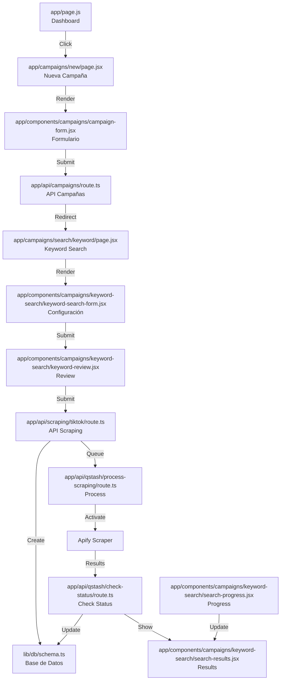

# Flujo de Búsqueda por Keywords 🎯

## Flujo Completo de Archivos 📁

1. **Dashboard Inicial**
   - `app/page.js` - Muestra el botón "Create campaign"
   - `app/components/campaigns/CampaignList.jsx` - Lista las campañas existentes

2. **Creación de Campaña**
   - `app/campaigns/new/page.jsx` - Página de nueva campaña
   - `app/components/campaigns/campaign-form.jsx` - Formulario de creación
   - `app/api/campaigns/route.ts` - Crea la campaña en la base de datos

3. **Configuración de Búsqueda**
   - `app/campaigns/search/keyword/page.jsx` - Página principal de búsqueda
   - `app/components/campaigns/keyword-search/keyword-search-form.jsx` - Formulario de configuración
   - `app/components/campaigns/keyword-search/keyword-review.jsx` - Revisión de keywords

4. **Proceso de Scraping**
   - `app/api/scraping/tiktok/route.ts` - Inicia el proceso de scraping
   - `app/api/qstash/process-scraping/route.ts` - Procesa el scraping
   - `app/api/qstash/check-status/route.ts` - Verifica el estado
   - `lib/db/schema.ts` - Almacena los datos en las tablas:
     - `campaigns`
     - `scraping_jobs`
     - `scraping_results`

5. **Seguimiento y Resultados**
   - `app/components/campaigns/keyword-search/search-progress.jsx` - Muestra el progreso
   - `app/components/campaigns/keyword-search/use-scraping-status.ts` - Hook de seguimiento
   - `app/components/campaigns/keyword-search/search-results.jsx` - Muestra los resultados

## Proceso Paso a Paso 🔄

### 1. Inicio en Dashboard
1. Usuario entra a `app/page.js`
2. Ve el botón "Create campaign"
3. Al hacer clic, se activa `app/campaigns/new/page.jsx`

### 2. Creación de Campaña
1. `app/components/campaigns/campaign-form.jsx` muestra el formulario
2. Usuario ingresa:
   - Nombre de campaña
   - Descripción
   - Selecciona "Keyword Search"
3. Al enviar, `app/api/campaigns/route.ts` crea la campaña en la base de datos

### 3. Configuración de Búsqueda
1. `app/campaigns/search/keyword/page.jsx` carga la página de búsqueda
2. `app/components/campaigns/keyword-search/keyword-search-form.jsx` muestra:
   - Selector de plataforma (TikTok)
   - Selector de cantidad de creadores (1000-5000) - Deseo cambiar el selector solo a 100, 500 y 1,000
3. `app/components/campaigns/keyword-search/keyword-review.jsx` permite:
   - Añadir keywords (máximo 10)
   - Revisar y editar keywords

### 4. Proceso de Scraping
1. `app/api/scraping/tiktok/route.ts`:
   - Recibe las keywords y configuración
   - Crea un job en la base de datos
   - Envía el job a QStash

2. `app/api/qstash/process-scraping/route.ts`:
   - Recibe el job de QStash
   - Activa el scraper de Apify
   - Actualiza el estado del job

3. `app/api/qstash/check-status/route.ts`:
   - Verifica el estado del scraping
   - Obtiene los resultados
   - Actualiza la base de datos

### 5. Seguimiento y Resultados
1. `app/components/campaigns/keyword-search/search-progress.jsx`:
   - Muestra barra de progreso
   - Actualiza cada 3 segundos
   - Usa `use-scraping-status.ts` para el polling

2. `app/components/campaigns/keyword-search/search-results.jsx`:
   - Muestra tabla de resultados
   - Permite paginación
   - Muestra detalles de cada creador

## Estados del Proceso 🔄

- ⏳ **Pendiente**: Job creado en `scraping_jobs`
- 🔄 **Procesando**: Scraper activo en Apify
- ✅ **Completado**: Resultados en `scraping_results`
- ❌ **Error**: Error registrado en `scraping_jobs`
- ⏰ **Tiempo excedido**: Job marcado como timeout

## Límites y Tiempos ⏱️

- Máximo tiempo de búsqueda: 60 minutos
- Actualización cada 3 segundos
- Máximo 10 palabras clave
- Entre 1000 y 5000 creadores por búsqueda

## Diagrama de Flujo 📊

---

*Nota: Este documento muestra el flujo exacto de archivos y componentes que se activan durante el proceso de búsqueda por keywords.*
