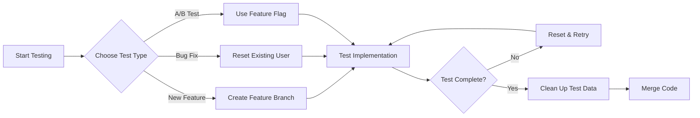

# Testing Onboarding Flows - Industry Best Practices

## Overview
Testing onboarding flows is a critical part of SaaS development. This document outlines industry-standard practices and tools for efficiently testing user onboarding without creating new accounts repeatedly.

## Quick Start - Reset User Script

### Basic Usage
```bash
# Reset a user to pre-onboarding state
npm run reset-user thalnerkarsanchay17@gmail.com

# Advanced TypeScript version with options
npm run reset-user:ts thalnerkarsanchay17@gmail.com --step=step-2 --set-trial=3
```

## Industry Standard Approaches

### 1. **Test User Management**

#### A. Dedicated Test Accounts
- **Practice**: Maintain a pool of test accounts with different states
- **Naming Convention**: `test+onboarding1@yourdomain.com`, `test+onboarding2@yourdomain.com`
- **Benefits**: Email aliases using `+` work with most email providers

```javascript
// Example test user pool
const testUsers = [
  'test+new@example.com',        // Fresh user
  'test+step1@example.com',       // Completed step 1
  'test+step2@example.com',       // Completed step 2
  'test+trial@example.com',       // Active trial
  'test+expired@example.com',     // Expired trial
  'test+paid@example.com',        // Paid user
];
```

#### B. Environment-Specific Features
```javascript
// Common pattern: Test mode in development
if (process.env.NODE_ENV === 'development') {
  // Show reset button in UI
  // Skip email verification
  // Allow instant trial expiry
}
```

### 2. **Database Seeding**

#### A. Seed Scripts
```javascript
// scripts/seed-test-users.js
const testStates = {
  freshUser: {
    onboardingStep: 'pending',
    trialStatus: 'inactive'
  },
  midOnboarding: {
    onboardingStep: 'step-2',
    fullName: 'Test User',
    businessName: 'Test Company'
  },
  activeTrialUser: {
    onboardingStep: 'completed',
    trialStatus: 'active',
    trialStartedAt: new Date(),
    trialExpiresAt: new Date(Date.now() + 7 * 24 * 60 * 60 * 1000)
  }
};
```

### 3. **Development Tools**

#### A. Admin Panel Features
```typescript
// Common admin tools for testing
interface AdminTestingTools {
  // User state management
  resetUserOnboarding(userId: string): Promise<void>;
  setOnboardingStep(userId: string, step: string): Promise<void>;
  setTrialExpiry(userId: string, date: Date): Promise<void>;
  
  // Time manipulation
  advanceTrialTime(userId: string, days: number): Promise<void>;
  triggerScheduledEmails(userId: string): Promise<void>;
  
  // Data management
  clearUserData(userId: string, options: ClearOptions): Promise<void>;
}
```

#### B. Browser DevTools Integration
```javascript
// Expose testing utilities in development
if (process.env.NODE_ENV === 'development') {
  window.__testing = {
    resetOnboarding: () => fetch('/api/dev/reset-onboarding'),
    skipToStep: (step) => fetch(`/api/dev/skip-to-step/${step}`),
    expireTrial: () => fetch('/api/dev/expire-trial'),
  };
}
```

### 4. **Testing Strategies**

#### A. Feature Flags
```javascript
// Use feature flags for testing different flows
const features = {
  'onboarding-v2': process.env.NEXT_PUBLIC_ONBOARDING_V2 === 'true',
  'skip-email-verification': process.env.NODE_ENV === 'development',
  'instant-trial-activation': process.env.ENABLE_INSTANT_TRIAL === 'true',
};
```

#### B. Time Travel Testing
```javascript
// Mock date/time for testing trial expiry
class TestTimeProvider {
  private offset = 0;
  
  advanceTime(days: number) {
    this.offset += days * 24 * 60 * 60 * 1000;
  }
  
  getCurrentTime() {
    return new Date(Date.now() + this.offset);
  }
}
```

### 5. **Automated Testing**

#### A. E2E Testing with Playwright/Cypress
```javascript
// cypress/e2e/onboarding.cy.js
describe('Onboarding Flow', () => {
  beforeEach(() => {
    // Reset test user before each test
    cy.task('resetUser', 'test@example.com');
  });
  
  it('completes full onboarding flow', () => {
    cy.login('test@example.com');
    cy.visit('/onboarding/step-1');
    // ... test steps
  });
});
```

#### B. API Testing
```javascript
// Jest/Vitest API tests
describe('Onboarding API', () => {
  let testUserId: string;
  
  beforeEach(async () => {
    testUserId = await createTestUser();
  });
  
  afterEach(async () => {
    await cleanupTestUser(testUserId);
  });
  
  test('updates onboarding step', async () => {
    const response = await api.post('/api/onboarding/step-1', {
      fullName: 'Test User',
      businessName: 'Test Co'
    });
    expect(response.status).toBe(200);
  });
});
```

## Our Implementation

### Reset Script Features

1. **Basic Reset** (`scripts/reset-user-onboarding.js`)
   - Resets user to pre-onboarding state
   - Clears trial data
   - Deletes scheduled emails
   - Updates Clerk metadata

2. **Advanced Reset** (`scripts/reset-user-onboarding.ts`)
   - Set specific onboarding step
   - Configure custom trial duration
   - Preserve campaigns/data selectively
   - Interactive confirmation

### Usage Examples

```bash
# Full reset
npm run reset-user thalnerkarsanchay17@gmail.com

# Reset to specific step
npm run reset-user:ts user@example.com --step=step-2

# Set custom trial (5 days)
npm run reset-user:ts user@example.com --set-trial=5

# Preserve campaigns
npm run reset-user:ts user@example.com --preserve-campaigns

# Skip confirmation
npm run reset-user:ts user@example.com --force
```

## Best Practices Summary

### 1. **DO's**
- ✅ Create reusable test accounts
- ✅ Use email aliases (user+test@domain.com)
- ✅ Build reset/seed scripts
- ✅ Add dev-only shortcuts
- ✅ Document test scenarios
- ✅ Use feature flags for A/B testing
- ✅ Implement time manipulation for trials

### 2. **DON'Ts**
- ❌ Create new accounts for every test
- ❌ Manually update database
- ❌ Test in production
- ❌ Hard-code test data
- ❌ Skip cleanup after tests

### 3. **Security Considerations**
- Always check environment before exposing test tools
- Use authentication for admin/test endpoints
- Never expose reset functionality in production
- Log all test operations for audit

## Additional Tools to Consider

### 1. **Mailhog/MailCatcher**
Local SMTP server for testing emails without sending real emails.

### 2. **Ngrok**
Expose local development server for webhook testing.

### 3. **Stripe Test Mode**
Use Stripe's test mode with test cards for payment flow testing.

### 4. **Feature Flag Services**
- LaunchDarkly
- Flagsmith
- Unleash
- PostHog

### 5. **Session Recording**
- FullStory
- LogRocket
- Hotjar

## Development Workflow



## Conclusion

The key to efficient onboarding testing is automation and reusability. Our reset scripts provide a quick way to test onboarding flows without the overhead of creating new accounts. Combined with proper test user management and development tools, you can iterate quickly while maintaining test quality.

For your specific use case with `thalnerkarsanchay17@gmail.com`, you can now simply run:

```bash
npm run reset-user thalnerkarsanchay17@gmail.com
```

This will reset the user to a fresh state, ready for testing your new onboarding flow.