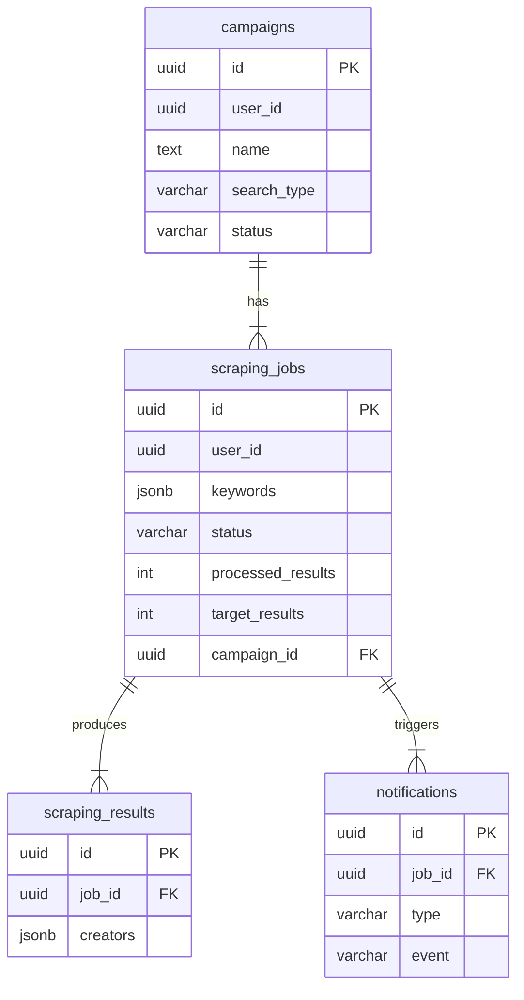
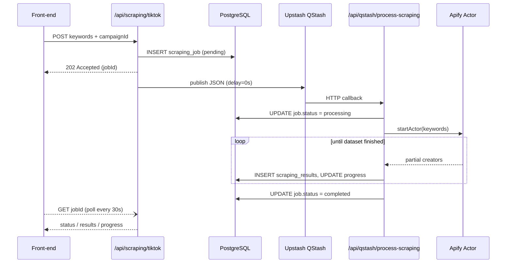

# Influencer Platform – Project Overview

Welcome to the Influencer Platform code-base!  
This document is the **single-source onboarding guide** for new front-end engineers and interns.  It explains **how the whole system fits together**, where to find things in the repository, and what happens under the hood when a feature is shipped.

---

## 1. Technology Stack

| Layer | Tech | Purpose |
|-------|------|---------|
| Front-end | **Next.js 15 (App Router)**, React 18, TypeScript | UI, routing, server components & server actions |
| Styling / UI | Tailwind CSS, Radix UI Primitives, Lucide-react icons, Framer-motion | Design-system & animation |
| Back-end | Next.js **API routes** (`app/api/**`) | REST/JSON endpoints & WebHooks |
| Database | PostgreSQL (managed by **Supabase**) | Persistent storage |
| ORM | **Drizzle ORM** | Type-safe SQL & migrations (`lib/db`) |
| Async jobs / Queue | **Upstash QStash** | Background processing & retries |
| Scraping | **Apify Actors** | External TikTok / Instagram data collection |
| E-mail | **Resend + React-Email** | Transactional notifications |

---

## 2. Source-code Layout (birds-eye)

```mermaid
flowchart LR
  subgraph Browser
    A(User)
  end

  subgraph Next.js (Edge/Node)
    B[React pages & components]
    C[API Routes]
  end

  subgraph Async Workers
    F[QStash – delayed HTTP]
    G[process-scraping route]
  end

  subgraph External   
    D[(PostgreSQL)]
    E[Apify Actors]
  end

  A -- fetch --> B
  B -- fetch('/api/...') --> C
  C -- SQL --> D
  C -- enqueue --> F
  F -- callback --> G
  G -- fetch dataset --> E
  G -- write --> D
  B -- SWR / polling --> C
```

Explanations:
1. **Front-end** calls an API route – e.g. `POST /api/scraping/tiktok` – to start a scraping job.
2. The route writes a **scraping_jobs** row and enqueues a delayed request in **QStash** (`/api/qstash/process-scraping`).
3. QStash fires the callback → the *process* route picks the job, calls **Apify** to run the actor, streams results back and writes to **scraping_results**.
4. The front-end polls `GET /api/scraping/tiktok?jobId=<id>` until `status === 'completed'` and then renders the creators list.

---

## 2.1. Directory Tree (level ≤ 2)

```text
. (repo root)
├── app/                # routes + UI
├── components/         # shared UI (legacy)
├── docs/               # internal specs & research
├── drizzle/            # Drizzle orm metadata
├── lib/                # database, queue wrappers, helpers
├── public/             # static assets
├── react-email-starter/# email templates
├── supabase/           # SQL migrations
├── utils/              # generic helpers
└── .cursor/            # Cursor AI rules (added)
```

*(Use `tree -L 2` to regenerate)*

---

## 3. High-level Architecture

```mermaid
flowchart LR
  subgraph Browser
    A(User)
  end

  subgraph Next.js (Edge/Node)
    B[React pages & components]
    C[API Routes]
  end

  subgraph Async Workers
    F[QStash – delayed HTTP]
    G[process-scraping route]
  end

  subgraph External   
    D[(PostgreSQL)]
    E[Apify Actors]
  end

  A -- fetch --> B
  B -- fetch('/api/...') --> C
  C -- SQL --> D
  C -- enqueue --> F
  F -- callback --> G
  G -- fetch dataset --> E
  G -- write --> D
  B -- SWR / polling --> C
```

Explanations:
1. **Front-end** calls an API route – e.g. `POST /api/scraping/tiktok` – to start a scraping job.
2. The route writes a **scraping_jobs** row and enqueues a delayed request in **QStash** (`/api/qstash/process-scraping`).
3. QStash fires the callback → the *process* route picks the job, calls **Apify** to run the actor, streams results back and writes to **scraping_results**.
4. The front-end polls `GET /api/scraping/tiktok?jobId=<id>` until `status === 'completed'` and then renders the creators list.

---

## 4. Database Model (simplified)



> Drizzle schema lives in `lib/db/schema.ts`.  Run `npm run db:generate` after editing it to emit type-safe queries.

---

## 5. Typical User Flow (Campaign keyword search)



---

## 6. Adding a New Feature

1. **Plan DB changes** → update `schema.ts`, run `npm run db:generate`, create a migration in `supabase/migrations`.
2. **API contract** → create a new folder in `app/api/<feature>` and export `route.ts` with the HTTP verbs you need.
3. **Front-end UI** → add a folder in `app/<feature>` with `page.tsx` and any nested components in `app/components/<feature>`.
4. **State / data-fetching** → prefer React Server Components & Server Actions; fallback to client SWR if you need real-time updates.
5. **Background work** → if something takes >1 s, publish a message to QStash and perform it in a callback route.

---

## 7. Local Development

```bash
# 1. Install deps
pnpm i   # or npm ci

# 2. Copy env
cp .env.local.example .env.local  # fill Supabase + QStash creds

# 3. Start DB (if you don't use remote Supabase)
# docker-compose up db

# 4. Run dev server
npm run dev
```

Useful scripts:
* `npm run db:push` – apply & migrate schema to Supabase
* `npm run drop` – drop all tables (dangerous!)

---

## 8. FAQ

**Where do I put shared UI?**  → `app/components/ui` or create a domain-specific sub-folder.

**How is auth handled?**  → Supabase Session is read in server components via `@supabase/ssr` `createClient()` helper (`app/utils/supabase/server.ts`). Client side uses the same library.

**Can I call the DB directly from the client?**  → *No.* Only via Server Actions or API routes to keep the secret credentials safe.

---

## 9. Zero-to-Productive Checklist (spoon-fed)

1. **Clone & install**
   ```bash
   git clone <repo>
   cd influencerplatform-main
   npm ci       # or pnpm i
   ```
2. **Environment**
   - Copy `.env.local.example` → `.env.local`.
   - Fill:
     - `NEXT_PUBLIC_SUPABASE_URL`
     - `NEXT_PUBLIC_SUPABASE_ANON_KEY`
     - `DATABASE_URL` (use `postgres://` connection)
     - `QSTASH_TOKEN`, `QSTASH_CURRENT_SIGNING_KEY`, `QSTASH_NEXT_SIGNING_KEY`
     - `APIFY_TOKEN`, `APIFY_ACTOR_ID`
   - Ask a senior dev if you're missing any secret.
3. **Database** (if using local Postgres):
   ```bash
   docker compose up -d db   # spins local Postgres
   npm run db:push           # applies migrations
   ````
4. **Dev server**
   ```bash
   npm run dev
   ```
   Browse http://localhost:3000.
5. **Run first scrape**
   - Sign-up in the app.
   - Create a **campaign**.
   - Run keyword scrape (`Campaign › keyword search`).
   - Observe logs in terminal; watch network requests to `/api/scraping/tiktok` and `/api/qstash/...`.
6. **Storybook (optional)** – run `npm run storybook` to preview isolated components.
7. **Testing**
   ```bash
   npm test            # jest + RTL
   ```
8. **Lint & format**
   ```bash
   npm run lint
   npm run format      # prettier
   ```

Follow this list and you'll have a working local environment in ~10 minutes.

---
